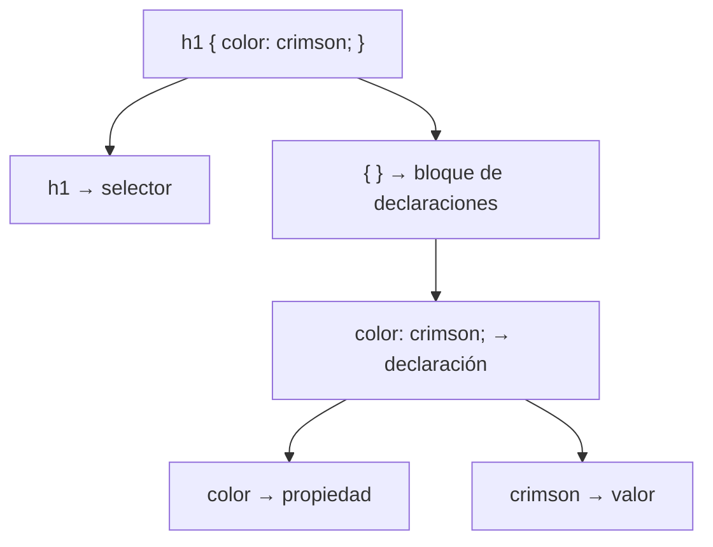

# Sintaxis CSS

> [!definicion]
> Una **regla** CSS asocia un **selector** (qué elementos) con un **bloque de declaraciones** (qué estilos aplicarles). Cada declaración es un par `propiedad: valor`. Es la unidad básica de toda hoja de estilos.

```css
selector {
  propiedad: valor;
  propiedad: valor;
}
```

Ejemplo concreto:

```css
h1 {
  color: crimson;
  font-size: 2rem;
}
```

## Las piezas



| Pieza | Qué es |
|-------|--------|
| Selector | A qué elementos se aplica |
| Declaración | Un par `propiedad: valor` |
| Bloque | El `{ }` que agrupa declaraciones |
| Regla | Selector + bloque, completa |

Detalle en [[01 Selector, Propiedad y Valor]], [[02 Declaración y Bloque]] y [[03 Regla Completa]].

## Mapa de la subsección

- [[01 Selector, Propiedad y Valor]] — las tres piezas mínimas.
- [[02 Declaración y Bloque]] — la declaración (`propiedad: valor;`) y el bloque que las agrupa.
- [[03 Regla Completa]] — cómo se ensamblan en una regla, y reglas con varios selectores.

## La importancia del punto y coma

> [!warning] El ; separa declaraciones
> Cada declaración termina en **punto y coma** (`;`). Omitirlo entre dos declaraciones hace que el navegador no entienda dónde acaba una y empieza la otra, e **ignora** ambas:
> ```css
> /* ❌ falta el ; tras crimson: ambas declaraciones fallan */
> h1 { color: crimson font-size: 2rem; }
>
> /* ✅ */
> h1 { color: crimson; font-size: 2rem; }
> ```
> El `;` de la **última** declaración es técnicamente opcional, pero conviene ponerlo siempre: así añadir otra declaración no rompe nada.

## Tolerancia a errores

> [!info] CSS ignora lo que no entiende
> CSS está diseñado para degradar con elegancia: si encuentra una propiedad o un valor que no reconoce (un error de tipeo, una propiedad muy nueva), **ignora esa declaración** y sigue con las demás. Esto es bueno (una regla nueva no rompe el resto) pero también traicionero: un error de sintaxis no da ningún mensaje, simplemente "no funciona". Ante un estilo que no se aplica, revisar la sintaxis es el primer paso.

## Notas relacionadas

- [[01 Selector, Propiedad y Valor]] — el detalle de cada pieza.
- [[03 Comentarios CSS]] — documentar las reglas.
- [[04 Selectores/index]] — la variedad de selectores.
