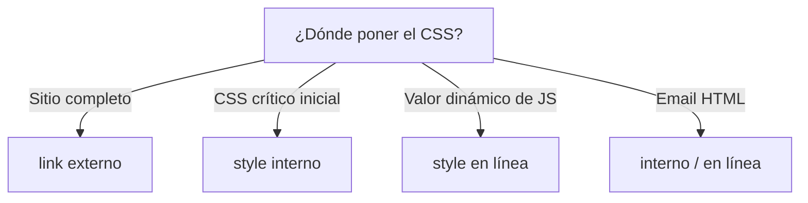

# Formas de Incluir CSS

> [!definicion]
> Hay cuatro maneras de aplicar CSS a una página: **externo** (un archivo `.css` enlazado), **interno** (un bloque `<style>`), **en línea** (el atributo `style`) e **importado** (`@import`). La primera es la recomendada en producción; las demás tienen usos puntuales.

```html
<link rel="stylesheet" href="estilos.css" />   <!-- externo (recomendado) -->
<style> h1 { color: navy; } </style>            <!-- interno -->
<h1 style="color: navy">…</h1>                  <!-- en línea (evitar) -->
```

## Las cuatro formas

| Forma | Cómo | Cacheable | Recomendado |
|-------|------|-----------|-------------|
| Externo | `<link rel="stylesheet">` | Sí | ✅ producción |
| Interno | `<style>` en el `<head>` | No (viaja con el HTML) | CSS crítico, email |
| En línea | atributo `style="…"` | No | 🚫 evitar |
| Importado | `@import` en CSS | Sí | ⚠️ con cuidado (rendimiento) |

Cada una en su nota: [[01 CSS Externo (link)]], [[02 CSS Interno (style)]], [[03 CSS en Línea (atributo style)]], [[04 Importar (@import)]].

## La recomendación clara

> [!tip] Externo por defecto
> En un sitio real, el CSS va en **archivos externos** enlazados con `<link>`: se cachea (una descarga sirve para todas las páginas), separa presentación de estructura, y es fácil de mantener. Las otras formas se reservan para casos concretos (CSS crítico inline para rendimiento, estilos inline calculados por JS, email HTML).

## Dónde encaja cada una



## Relación con HTML

Estas formas se corresponden con elementos y atributos vistos en el curso de HTML: [[07 Enlace a CSS (link) | `<link>`]], [[08 Estilos Internos (style) | `<style>`]] y el atributo [[02 Estilo en Línea (style) | `style`]]. Aquí se ven desde la perspectiva de CSS.

## Notas relacionadas

- [[01 CSS Externo (link)]] — la forma recomendada.
- [[03 CSS en Línea (atributo style)]] — por qué evitarla.
- [[09 Arquitectura y Metodologías/index]] — organizar el CSS externo a escala.
