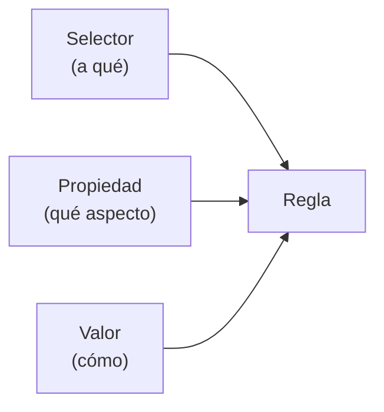

# Fundamentos del Estilo

> [!definicion]
> CSS (Cascading Style Sheets) describe **cómo se ve** el HTML: colores, tipografía, tamaños, espaciado. Una hoja de estilos es un conjunto de **reglas**, y cada regla asocia un [[01 Sintaxis CSS/index | selector]] (qué elementos) con unas declaraciones (qué propiedades y valores aplicarles).

```css
h1 {
  color: #cba6f7;
  font-size: 2rem;
}
```

Esta sección cubre los cimientos: la sintaxis, cómo enlazar CSS al HTML, los selectores que apuntan a los elementos, y los valores básicos (colores, unidades, texto) que se usan en todas las propiedades.

## Mapa de la sección

- [[01 Sintaxis CSS/index]] — la anatomía de una regla: selector, propiedad, valor, declaración.
- [[02 Formas de Incluir CSS/index]] — externo, interno, en línea, `@import`.
- [[03 Comentarios CSS]] — documentar y desactivar reglas.
- [[04 Selectores/index]] — apuntar a los elementos (tipo, clase, id, combinadores, atributo).
- [[05 Colores/index]] — los formatos de color (hex, rgb, hsl, lab…).
- [[06 Unidades de Medida/index]] — px, em, rem, %, vw, `calc()`, `clamp()`…
- [[07 Propiedades de Texto/index]] — color, fuente, tamaño, alineación, decoración.
- [[08 Herencia y Valores/index]] — herencia natural y valores especiales (`inherit`, `initial`…).

## Las tres patas de CSS



| Pieza | Responde a | Ejemplo |
|-------|------------|---------|
| Selector | ¿A qué elementos? | `h1`, `.boton`, `#menu` |
| Propiedad | ¿Qué característica? | `color`, `font-size` |
| Valor | ¿Con qué valor? | `#cba6f7`, `2rem` |

## CSS no se memoriza, se consulta

> [!tip] La filosofía de este curso
> CSS tiene cientos de propiedades; nadie las recuerda todas. El valor está en saber **qué propiedad existe** para cada necesidad y **qué valores acepta**. Por eso estas notas ponen arriba la tabla de valores y el snippet que más se copia: son una referencia para relectura, no un tutorial que se lee una vez.

## La separación de capas

CSS es la capa de **presentación**, separada de la estructura (HTML) y el comportamiento (JavaScript). El HTML define qué es cada cosa; CSS, cómo se ve; JS, cómo se comporta. Mantenerlas separadas —CSS en archivos `.css`, no en atributos `style`— es la base de un código mantenible.

## Notas relacionadas

- [[01 Sintaxis CSS/index]] — el punto de partida.
- [[04 Selectores/index]] — cómo apuntar a los elementos.
- [[09 Arquitectura y Metodologías/index]] — cómo organizar el CSS a escala.
