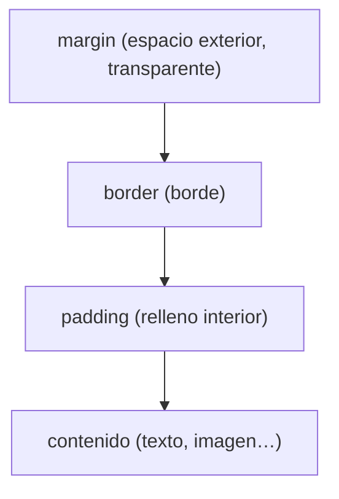

# Modelo de Caja

> [!definicion]
> El **modelo de caja** (box model) es el principio fundamental del layout en CSS: **cada elemento** se representa como una caja rectangular formada por cuatro capas concéntricas — **contenido**, **padding** (relleno), **border** (borde) y **margin** (margen). Entender cómo se suman estas capas es la base de todo dimensionamiento.

```css
.caja {
  width: 200px;        /* contenido */
  padding: 1rem;       /* relleno interior */
  border: 2px solid;   /* borde */
  margin: 1rem;        /* espacio exterior */
}
```

## Las cuatro capas



| Capa | Qué es |
|------|--------|
| Contenido | El texto, imagen o hijos |
| Padding | Espacio entre el contenido y el borde |
| Border | La línea del borde |
| Margin | Espacio exterior, separa de otros elementos |

El detalle de cada capa, en [[01 Partes del Modelo de Caja]]; las dimensiones en [[01 width y height]], el relleno en [[03 Padding]], el borde en [[04 Border/index]] y el margen en [[05 Margin]].

## La pregunta clave: ¿qué incluye width?

> [!warning] El cálculo del tamaño cambia con box-sizing
> La duda más importante del modelo de caja: cuando pones `width: 200px`, ¿esos 200px incluyen el padding y el borde, o solo el contenido? Depende de [[06 box-sizing | `box-sizing`]]:
> - **`content-box`** (por defecto): `width` es **solo el contenido**; padding y borde se **suman** aparte. Una caja de `width: 200px; padding: 20px; border: 2px` ocupa **244px**.
> - **`border-box`**: `width` incluye padding y borde. Esa misma caja ocupa **200px**, restando el espacio interno al contenido.
>
> Por su mayor intuición, casi todos los proyectos ponen `box-sizing: border-box` globalmente. Es el primer reset que conviene aprender.

## Mapa de la sección

- [[01 Partes del Modelo de Caja]] — contenido, padding, border, margin en detalle.
- [[02 Dimensiones/index]] — `width`/`height`, `min`/`max`, `aspect-ratio`, tamaños de contenido.
- [[03 Padding]] — el relleno interior.
- [[04 Border/index]] — el borde y sus propiedades (incluido `border-radius`).
- [[05 Margin]] — el margen exterior y `margin: auto`.
- [[06 box-sizing]] — qué incluye `width` (el reset clave).
- [[07 Margin Collapse]] — el colapso de márgenes verticales, una rareza importante.

## Notas relacionadas

- [[06 box-sizing]] — el ajuste que más cambia el comportamiento de las cajas.
- [[01 Flujo Normal del Documento/index]] — cómo se colocan las cajas (block, inline…).
- [[05 Porcentajes]] — los porcentajes en el modelo de caja.
