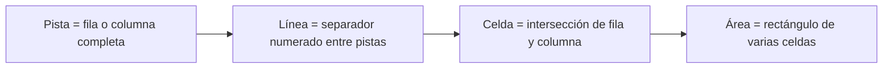

# Conceptos (pistas, líneas, celdas, áreas)

> [!definicion]
> Grid tiene un vocabulario propio que conviene dominar antes de colocar items: **pistas** (las filas/columnas), **líneas** (los separadores numerados), **celdas** (las intersecciones) y **áreas** (rectángulos de varias celdas). Casi todas las propiedades de Grid se refieren a uno de estos cuatro.



## Pista (track)

Una **pista** es una fila o columna **completa** de la rejilla. `grid-template-columns: 1fr 2fr 1fr` define **tres pistas** de columna. El espacio entre pistas lo da el [[07 Espaciado (gap) | `gap`]].

## Línea (line): la base para colocar

> [!info] Las líneas se numeran, y por ellas se colocan los items
> Las **líneas** son los separadores entre pistas, **numerados desde 1**. Una rejilla de 3 columnas tiene **4 líneas** verticales (1 a 4, más la -1 desde el final). Los items se colocan **entre líneas**, no "en columnas":
> ```css
> .item { grid-column: 1 / 3; }   /* de la línea 1 a la 3 = ocupa 2 columnas */
> ```
> Entender que se posiciona **por líneas** (de la línea X a la Y) es la clave de [[07 Ubicación por Líneas (grid-column, grid-row) | colocar items]]. La línea `-1` es siempre la última (útil para "hasta el final").

## Celda (cell)

La **celda** es la unidad mínima: la intersección de una fila y una columna. Por defecto, cada item ocupa una celda; con [[08 Span | `span`]] puede ocupar varias.

## Área (area)

Un **área** es un rectángulo de **varias celdas** contiguas. Se pueden nombrar las áreas y maquetar visualmente con [[09 Áreas (grid-template-areas) | `grid-template-areas`]]:

```css
grid-template-areas:
  "cabecera cabecera"
  "menu     contenido"
  "pie      pie";
```

## Las líneas con nombre

Además de números, las líneas pueden tener **nombres**, lo que hace el código más legible:

```css
grid-template-columns: [inicio] 1fr [medio] 2fr [fin];
.item { grid-column: inicio / fin; }
```

## El sistema de coordenadas

> [!tip] Piensa en líneas, no en columnas
> El cambio mental clave al aprender Grid: no pienses "este item va en la columna 2", sino "este item va **de la línea 2 a la 3**". Colocar y extender items siempre se expresa en términos de **líneas** (de dónde a dónde), lo que da una flexibilidad enorme (un item puede ir de la línea 1 a la 4, cruzando varias columnas).

## Buenas prácticas

> [!tip] Recomendaciones
> - Domina los cuatro términos: pista (fila/columna), línea (separador numerado), celda, área.
> - Piensa la colocación en **líneas** (de X a Y), no en "columnas".
> - Usa la línea `-1` para "hasta el final".
> - Nombra líneas o usa áreas para código más legible en layouts complejos.

## Notas relacionadas

- [[03 grid-template-columns y rows]] — definir las pistas.
- [[07 Ubicación por Líneas (grid-column, grid-row)]] — colocar por líneas.
- [[09 Áreas (grid-template-areas)]] — maquetar con áreas nombradas.
