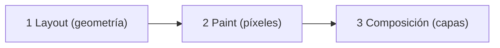

# Layout, Paint y Composición

> [!definicion]
> El navegador dibuja la página en una **secuencia de fases**: calcular dónde va cada elemento (**layout**), pintar sus píxeles (**paint**) y combinar las capas en pantalla (**composición**). Cuánto cuesta animar una propiedad depende de **cuántas fases** dispara: cuantas más, más caro.

## Las tres fases

| Fase | Qué hace | Coste |
|------|----------|-------|
| **Layout** (reflow) | Calcula posición y tamaño de cada elemento | **Alto** (afecta a toda la página) |
| **Paint** | Pinta los píxeles (color, bordes, sombras) | Medio |
| **Composición** | Combina las capas ya pintadas | **Bajo** (GPU) |

## La cascada de fases

> [!warning] Tocar una fase temprana dispara las siguientes
> Las fases van en orden, así que cambiar una propiedad de una fase **temprana** obliga a rehacer **todas las siguientes**:
> - Animar `width`/`top`/`margin` → cambia el **layout** → fuerza **layout + paint + composición** (lo más caro).
> - Animar `background`/`box-shadow`/`color` → cambia el **paint** → fuerza **paint + composición**.
> - Animar `transform`/`opacity` → solo **composición** (lo más barato).
>
> Por eso animar `transform` es tan superior: salta las dos fases caras y va directo a la composición, que la GPU hace casi gratis.

## Qué propiedad dispara qué

| Propiedad animada | Fases que dispara |
|-------------------|-------------------|
| `width`, `height`, `top`, `left`, `margin`, `padding` | Layout + Paint + Composición |
| `background`, `color`, `box-shadow`, `border-radius` | Paint + Composición |
| `transform`, `opacity`, `filter` | Solo Composición (GPU) |

## El reflow es lo más caro

> [!info] Un cambio de layout afecta a toda la página
> El **layout (reflow)** es la fase más costosa porque un cambio de tamaño/posición de un elemento puede **desplazar a muchos otros**: el navegador recalcula la geometría de gran parte de la página. Hacer esto **60 veces por segundo** (lo que exige una animación) es lo que provoca los tirones. Animar `width` de un elemento puede obligar a recolocar todo lo que tiene alrededor en cada fotograma.

## Diagnosticar con DevTools

> [!tip] El panel Performance muestra las fases
> Las DevTools del navegador (panel **Performance** / **Rendimiento**) muestran qué fases dispara cada animación y dónde hay tirones (frames que tardan más de 16ms). "Paint flashing" resalta lo que se repinta. Son la forma de **medir** en vez de adivinar qué está costando caro.

## Buenas prácticas

> [!tip] Recomendaciones
> - Anima propiedades de **composición** (`transform`, `opacity`): evitan layout y paint.
> - Evita animar propiedades de **layout** (`width`, `top`, `margin`): el reflow es caro.
> - Si necesitas un efecto de tamaño, usa `transform: scale()` en vez de `width`.
> - Mide con el panel Performance de DevTools; no adivines.

## Errores comunes

> [!warning] Trampas
> - **Animar `left`/`top`/`width`**: reflow en cada fotograma, tirones.
> - **Animar `box-shadow` grande**: paint costoso (anima la opacidad de una sombra en un pseudoelemento).
> - **Adivinar** el rendimiento en vez de medirlo con DevTools.

## Notas relacionadas

- [[03 Animar transform y opacity]] — la regla práctica derivada de esto.
- [[02 will-change]] — promover un elemento a su capa de composición.
- [[03 Transformaciones (transform)/index]] — la propiedad de composición.
