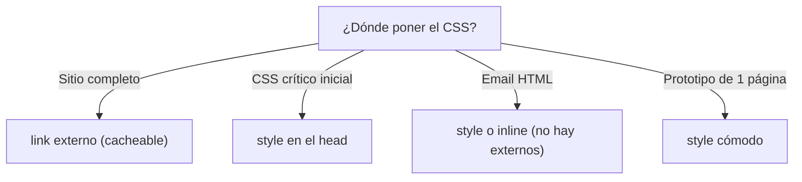

# Estilos Internos (style)

> [!definicion]
> `<style>` incrusta reglas CSS **dentro del propio HTML**, normalmente en el [[index | `<head>`]]. A
> diferencia de [[07 Enlace a CSS (link) | `<link>`]], el CSS viaja con el documento: no hay petición
> de red extra, pero tampoco se cachea ni se comparte entre páginas. Es una de las **tres formas** de
> aplicar CSS, cada una con su lugar.

```html
<head>
  <style>
    body { margin: 0; font-family: system-ui; }
    .destacado { color: crimson; }
  </style>
</head>
```

## Las tres formas de aplicar CSS

| Forma | Marcado | Cacheable | Especificidad | Cuándo |
|-------|---------|-----------|---------------|--------|
| Externa | `<link rel="stylesheet">` | Sí | Normal | Producción, sitio completo |
| Interna / embebida | `<style>` en el `<head>` | No (viaja con el HTML) | Normal | CSS crítico, email, demo |
| En línea | atributo `style="…"` | No | Muy alta | Evitar (salvo casos puntuales) |

`<style>` (un bloque de reglas) **no es lo mismo** que el atributo
[[02 Estilo en Línea (style) | `style="…"`]] en un elemento: este último aplica a un solo elemento,
tiene altísima especificidad y se considera mala práctica.

## Cuándo conviene cada una



- **Sitio real** → externo: una sola descarga sirve para todas las páginas.
- **CSS crítico** → `<style>` con lo mínimo visible al cargar, y el resto diferido.
- **Email HTML** → `<style>` o inline, porque los clientes de correo no cargan archivos externos.
- **Prototipo / demo de una página** → `<style>` por comodidad, todo en un archivo.

## Técnica: CSS crítico above-the-fold

Una optimización de rendimiento real combina ambas formas: se **incrusta** con `<style>` el CSS
mínimo necesario para pintar lo visible sin scroll (*above the fold*), y el resto de la hoja se
**difiere** para que no bloquee:

```html
<head>
  <style>/* CSS crítico inline: layout y tipografía base */</style>
  <link rel="preload" href="resto.css" as="style"
        onload="this.rel='stylesheet'" />
</head>
```

Así el primer pintado no espera a la hoja completa, eliminando el render-blocking sin sacrificar el
estilo inicial.

## Buenas prácticas

> [!tip] Recomendaciones
> - En producción, **externo por defecto**; `<style>` solo para CSS crítico o contextos sin archivos
>   externos (email).
> - Mantén el `<style>` en el `<head>`, no esparcido por el `<body>` (aunque sea válido, complica el
>   mantenimiento).
> - El atributo `media` también funciona en `<style media="print">`.

## Errores comunes

> [!warning] Trampas
> - **Confundir `<style>` con `style="…"`**: el bloque `<style>` define reglas reutilizables; el
>   atributo aplica a un elemento y debe evitarse.
> - **CSS interno duplicado** en cada página de un sitio: se pierde la ventaja de la caché; mejor
>   externo.
> - **Olvidar escapar `<` en selectores con contenido generado**: poco común, pero un `</style>`
>   literal dentro cierra el bloque antes de tiempo.

## Notas relacionadas

- [[07 Enlace a CSS (link)]] — la alternativa externa, preferida en producción.
- [[02 Estilo en Línea (style)]] — el atributo `style` por elemento (atributo global).
