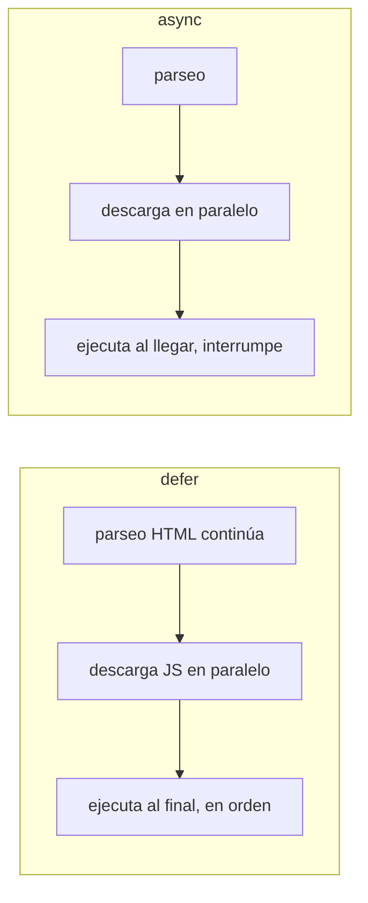

# Scripts (script)

> [!definicion]
> `<script>` incrusta JavaScript inline o enlaza un archivo `.js` externo con `src`. Es el puente
> entre la estructura (HTML) y el comportamiento (JS). **Dónde** se coloca y **cómo** se carga
> determina si bloquea la construcción de la página, por lo que es uno de los elementos con mayor
> impacto en el rendimiento percibido.

```html
<!-- Externo, no bloqueante: se ejecuta tras parsear el HTML -->
<script src="/js/app.js" defer></script>

<!-- Inline -->
<script>
  console.log("Hola desde el documento");
</script>
```

## El problema: el parser se detiene ante un script

Cuando el navegador encuentra un `<script>` sin atributos de carga, **para de construir el DOM**,
descarga el archivo (si es externo), lo ejecuta, y solo entonces continúa. Un script pesado al inicio
deja la página en blanco mientras tanto. Los atributos `defer` y `async` existen para evitarlo.

## Atributos de carga: defer vs async vs nada

| Forma | Descarga | Ejecución | Orden entre scripts | Bloquea parseo |
|-------|----------|-----------|---------------------|----------------|
| (sin atributo) | Inmediata | Al terminar de descargar | En orden de aparición | **Sí** |
| `defer` | En paralelo al parseo | Tras parsear todo el DOM, antes de `DOMContentLoaded` | En orden | No |
| `async` | En paralelo al parseo | En cuanto descarga (interrumpe) | **Sin garantía** | Parcial |



### Cuándo usar cada uno

- **`defer`** — el patrón por defecto para scripts de la app que dependen del DOM y entre sí (orden
  importa). Es la recomendación general.
- **`async`** — para scripts **independientes** que no dependen del DOM ni de otros scripts:
  analítica, anuncios, widgets de terceros. Se ejecutan en cuanto llegan, sin orden garantizado.
- **Sin atributo** — solo cuando el script debe ejecutarse exactamente en ese punto del documento
  (raro hoy).

## Módulos ES

`type="module"` carga el script como módulo ECMAScript, con soporte de `import`/`export`. Los módulos
son **`defer` por defecto** y se ejecutan en modo estricto:

```html
<script type="module" src="/js/main.js"></script>
```

## Dónde colocarlo

- **`defer` en el `<head>`** — patrón moderno recomendado: descarga temprano (en paralelo), ejecuta
  cuando el DOM está listo, sin bloquear el render.
- **Al final del `<body>`** — patrón clásico equivalente: cuando el script corre, el DOM ya existe.
- **Sin `defer`/`async` en mitad del documento** — bloquea; evitar.

## Buenas prácticas

> [!tip] Recomendaciones
> - **Por defecto, `defer`** para el código propio; `async` para terceros independientes.
> - Un solo punto de entrada (`app.js`/`main.js`) con módulos, mejor que diez `<script>` sueltos.
> - Para terceros externos, añade `integrity` + `crossorigin` (SRI) cuando el proveedor lo soporte.

## Errores comunes

> [!warning] Trampas
> - **Script bloqueante al inicio del `<head>`** sin `defer`: congela el parseo y deja la página en
>   blanco hasta que descarga y ejecuta.
> - **Esperar el DOM con un script en el `<head>` sin `defer`**: el script corre antes de que existan
>   los elementos; `document.querySelector(...)` devuelve `null`.
> - **JS inline en atributos** (`onclick="…"`): rompe la separación de capas y dificulta la Content
>   Security Policy. El comportamiento se delega al curso de [[02 Modificar Atributos | JavaScript]].

## Notas relacionadas

- [[07 Enlace a CSS (link)]] — el equivalente para CSS y el porqué del orden de carga.
- [[index]] — el `<head>` y el orden recomendado de sus elementos.
