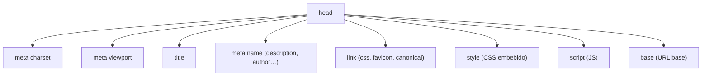

# Cabecera (head)

> [!definicion]
> `<head>` agrupa los **metadatos** del documento: información *sobre* la página que el navegador,
> los buscadores y las redes sociales leen, pero que **no se renderiza** como contenido visible. Es
> el primer hijo de [[02 Elemento Raíz (html) | `<html>`]], antes de
> [[04 Cuerpo (body) | `<body>`]]. Si el `<body>` habla con la persona, el `<head>` habla con la
> máquina.

```html
<head>
  <meta charset="UTF-8" />
  <meta name="viewport" content="width=device-width, initial-scale=1.0" />
  <title>Mi página</title>
  <meta name="description" content="Resumen de la página." />
  <link rel="stylesheet" href="estilos.css" />
</head>
```

La única excepción a "no se renderiza" es [[03 Título del Documento (title) | `<title>`]], cuyo texto
aparece en la pestaña del navegador.

## Qué puede contener

El `<head>` admite una familia acotada de elementos, todos de metadatos:



- [[01 Codificación de Caracteres (meta charset)]] — `<meta charset>`: codificación de caracteres.
- [[02 Viewport (meta viewport)]] — `<meta viewport>`: escala en móvil.
- [[03 Título del Documento (title)]] — `<title>`: título de la pestaña y del buscador.
- [[04 Descripción (meta description)]] — `<meta name="description">`: resumen para buscadores.
- [[06 Autor (meta author)]] — `<meta name="author">`: autor del documento.
- [[07 Enlace a CSS (link)]] — `<link rel="stylesheet">`: hoja de estilos externa.
- [[08 Estilos Internos (style)]] — `<style>`: CSS embebido.
- [[09 Scripts (script)]] — `<script>`: JavaScript.
- [[10 Favicon (link rel icon)]] — `<link rel="icon">`: favicon.
- [[11 Enlace Canónico (link rel canonical)]] — `<link rel="canonical">`: URL oficial.
| `<base>` | URL base para enlaces relativos | — |

## El orden importa para el rendimiento

El `<head>` no es una lista desordenada: la posición de cada elemento afecta a cómo y cuándo el
navegador procesa la página.

### Orden recomendado

1. **`<meta charset>` primero** — el parser necesita saber la codificación antes de leer texto. Debe
   estar dentro de los primeros 1024 bytes.
2. **`<meta viewport>`** — justo después, para que el layout responsivo se calcule desde el inicio.
3. **`<title>` y metadatos SEO** — título, descripción, Open Graph.
4. **CSS (`<link rel="stylesheet">`)** — antes del contenido, para evitar el *flash* de contenido sin
   estilo (FOUC).
5. **`<script defer>`** — al final del head o con `defer`/`async`, nunca bloqueando.

### Por qué el CSS bloquea y conviene que lo haga

El CSS del `<head>` es **render-blocking**: el navegador no pinta hasta tenerlo. Esto es deseable —
evita que el usuario vea un instante de HTML sin estilo— siempre que la hoja sea ligera. Un CSS
enorme retrasa el primer pintado, de ahí la técnica del CSS crítico (ver
[[08 Estilos Internos (style) | `<style>`]]).

## Buenas prácticas

> [!tip] Lo imprescindible en todo head
> Estas tres líneas no deberían faltar nunca: sin `charset` el texto se corrompe, sin `viewport` el
> móvil simula un escritorio, sin `title` la pestaña y el resultado de búsqueda quedan sin nombre.
> ```html
> <meta charset="UTF-8" />
> <meta name="viewport" content="width=device-width, initial-scale=1.0" />
> <title>…</title>
> ```

> [!info] El head es el centro del SEO técnico
> Más allá de lo básico, el `<head>` alberga toda la maquinaria de posicionamiento y compartido
> social: descripción, canónica, Open Graph, Twitter Cards, datos estructurados. El detalle vive en
> [[09 Metadatos y SEO/index | Metadatos y SEO]].

## Errores comunes

> [!warning] No metas contenido aquí
> Texto, encabezados o imágenes dentro del `<head>` rompen la estructura: en cuanto el parser
> encuentra contenido de flujo, **cierra el `<head>` y abre el `<body>`** automáticamente. El
> resultado es un DOM distinto del escrito. Regla simple: si algo se ve en pantalla, va en el
> `<body>`; si es información para la máquina, va en el `<head>`.

## Notas relacionadas

- [[02 Elemento Raíz (html)]] — su padre.
- [[04 Cuerpo (body)]] — su contraparte visible.
- [[09 Metadatos y SEO/index]] — metadatos avanzados (Open Graph, Twitter, JSON-LD).
