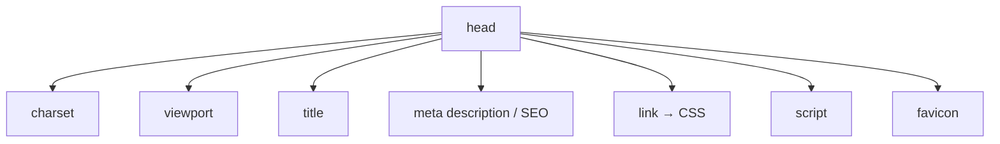

# Cabecera (head)

> [!definicion]
> `<head>` agrupa los **metadatos** del documento: información sobre la página que el navegador y
> los buscadores leen, pero que **no se renderiza** como contenido. Es el primer hijo de
> [[02 Elemento Raíz (html) | `<html>`]], antes de [[04 Cuerpo (body) | `<body>`]].

```html
<head>
  <meta charset="UTF-8" />
  <meta name="viewport" content="width=device-width, initial-scale=1.0" />
  <title>Mi página</title>
  <link rel="stylesheet" href="estilos.css" />
</head>
```

La única excepción a "no se renderiza" es [[03 Título del Documento (title) | `<title>`]], que
aparece en la pestaña del navegador.

## Qué vive en el head



| Contenido | Elemento | Nota |
|-----------|----------|------|
| Codificación de caracteres | `<meta charset>` | [[01 Codificación de Caracteres (meta charset)]] |
| Escala en móvil | `<meta viewport>` | [[02 Viewport (meta viewport)]] |
| Título de la pestaña | `<title>` | [[03 Título del Documento (title)]] |
| Resumen para buscadores | `<meta description>` | [[04 Descripción (meta description)]] |
| Hoja de estilos | `<link rel="stylesheet">` | [[07 Enlace a CSS (link)]] |
| Código JavaScript | `<script>` | [[09 Scripts (script)]] |
| Icono de pestaña | `<link rel="icon">` | [[10 Favicon (link rel icon)]] |
| URL canónica | `<link rel="canonical">` | [[11 Enlace Canónico (link rel canonical)]] |

> [!tip] El orden importa para el rendimiento
> `<meta charset>` debe ir **primero** (en los primeros 1024 bytes) para que el parser sepa cómo
> decodificar el resto. El `<viewport>` justo después. El CSS antes que el contenido (evita FOUC);
> los `<script>` con `defer` o al final, para no bloquear el parseo.

> [!warning] No metas contenido aquí
> Texto, encabezados o imágenes dentro del `<head>` rompen la estructura: el parser cierra el
> `<head>` y abre el `<body>` en cuanto encuentra contenido de flujo. Si algo se ve en pantalla,
> va en el `<body>`.

## Notas relacionadas

- [[02 Elemento Raíz (html)]] — su padre.
- [[04 Cuerpo (body)]] — su contraparte visible.
- [[09 Metadatos y SEO/index]] — metadatos avanzados (Open Graph, JSON-LD).
