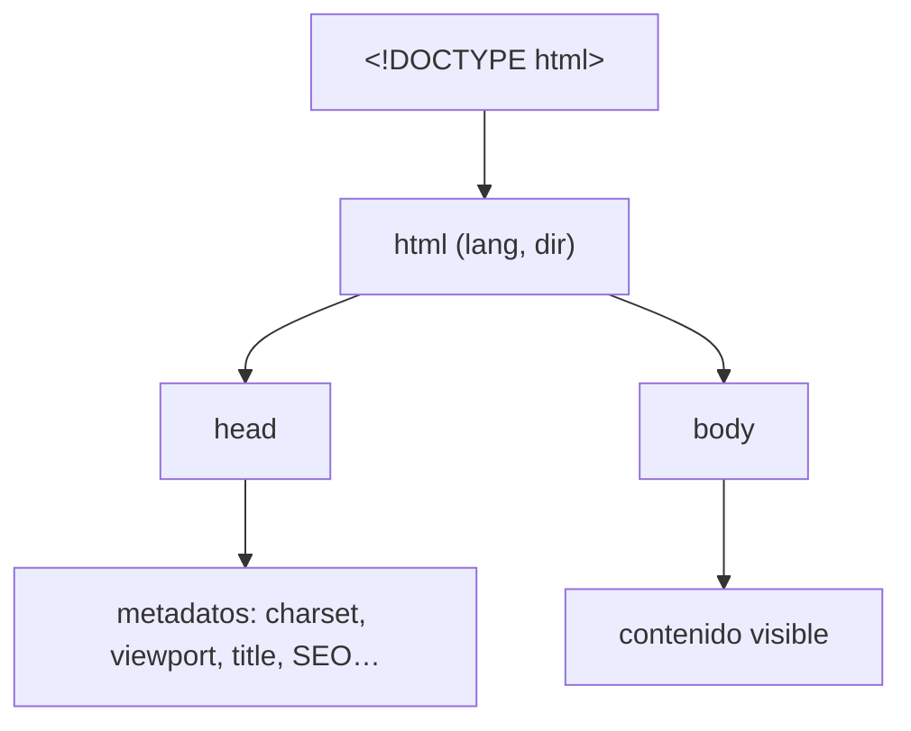

# Estructura del Documento

> [!definicion]
> Todo documento HTML válido se compone de cuatro piezas en un orden fijo: la declaración
> [[01 Declaración DOCTYPE | DOCTYPE]], el [[02 Elemento Raíz (html) | elemento raíz `<html>`]], la
> [[03 Cabecera (head)/index | cabecera `<head>`]] con los metadatos, y el
> [[04 Cuerpo (body) | cuerpo `<body>`]] con el contenido visible. Sobre este esqueleto el navegador
> construye el **árbol DOM** que luego se estiliza con CSS y se anima con JavaScript.

El navegador no renderiza marcado suelto: parsea esta jerarquía y, si falta o se desordena, la
**corrige** insertando elementos implícitos. No hay error visible, pero el DOM resultante suele
diferir de la intención, y de ahí nacen bugs difíciles de rastrear.

## Boilerplate mínimo

```html
<!DOCTYPE html>
<html lang="es">
  <head>
    <meta charset="UTF-8" />
    <meta name="viewport" content="width=device-width, initial-scale=1.0" />
    <title>Título de la página</title>
  </head>
  <body>
    <!-- contenido visible -->
  </body>
</html>
```

Estas son las únicas líneas que **deben** estar en cada documento. Cada omisión tiene un síntoma
concreto:

| Si falta… | Ocurre |
|-----------|--------|
| `<!DOCTYPE html>` | El navegador entra en *quirks mode* (box model roto) |
| `lang` | Lectores de pantalla y traducción fallan |
| `<meta charset>` | Tildes y `ñ` se corrompen (*mojibake*) |
| `<meta viewport>` | El móvil simula un escritorio y la página se ve diminuta |
| `<title>` | La pestaña y el resultado de búsqueda quedan sin nombre |

## Árbol de la estructura



## Las cuatro piezas

| Pieza | Rol | ¿Visible? |
|-------|-----|-----------|
| `<!DOCTYPE html>` | Activa el modo estándar | No |
| `<html>` | Nodo raíz; fija idioma y dirección | — |
| `<head>` | Metadatos para navegador y buscadores | No (salvo `<title>`) |
| `<body>` | Contenido que ve y usa la persona | Sí |

Cada pieza tiene su nota: [[01 Declaración DOCTYPE]], [[02 Elemento Raíz (html)]],
[[03 Cabecera (head)/index | la cabecera `<head>`]] y [[04 Cuerpo (body)]].

## El principio rector: máquina vs. persona

> [!info] Separación de responsabilidades
> El `<head>` habla con la **máquina** (codificación, SEO, hojas de estilo, scripts); el `<body>`
> habla con la **persona** (texto, imágenes, formularios). Mezclarlos —estilos sueltos en el body,
> contenido en el head— es el origen de buena parte de los bugs de renderizado. La misma lógica de
> separación se extiende dentro del proyecto: estructura en HTML, presentación en CSS, comportamiento
> en JavaScript.

## La prueba del documento mínimo

Un buen ejercicio de comprensión: escribir desde cero el boilerplate sin copiar, entendiendo **por
qué** está cada línea y en ese orden (charset primero por el parseo, viewport para el responsive,
CSS antes del contenido para evitar el FOUC). Si cada línea tiene una justificación, la estructura
está interiorizada.

## Notas relacionadas

- [[01 Declaración DOCTYPE]] — la primera línea y los modos de renderizado.
- [[02 Elemento Raíz (html)]] — el contenedor de todo y el idioma del documento.
- [[03 Cabecera (head)/index]] — el mapa completo de metadatos.
- [[04 Cuerpo (body)]] — dónde vive y cómo se organiza el contenido.
