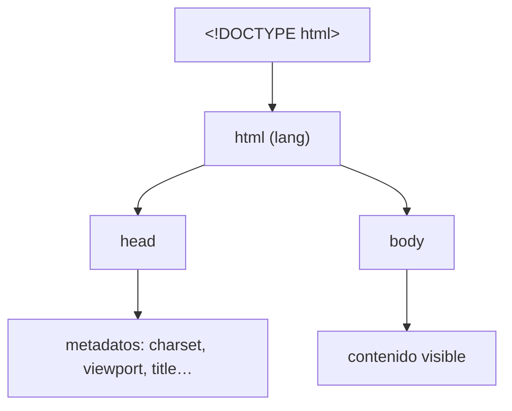

# Estructura del Documento

> [!definicion]
> Todo documento HTML válido se compone de cuatro piezas en un orden fijo: la declaración
> [[01 Declaración DOCTYPE | DOCTYPE]], el [[02 Elemento Raíz (html) | elemento raíz `<html>`]],
> la [[03 Cabecera (head)/index | cabecera `<head>`]] con los metadatos, y el
> [[04 Cuerpo (body) | cuerpo `<body>`]] con el contenido visible.

El navegador no renderiza marcado suelto: construye un **árbol DOM** a partir de esta jerarquía.
Romper el orden (un `<title>` fuera del `<head>`, contenido antes del `<body>`) no produce un
error visible, pero el parser **corrige** la estructura insertando elementos implícitos, lo que
suele divergir de la intención.

## Boilerplate mínimo

```html
<!DOCTYPE html>
<html lang="es">
  <head>
    <meta charset="UTF-8" />
    <meta name="viewport" content="width=device-width, initial-scale=1.0" />
    <title>Título de la página</title>
  </head>
  <body>
    <!-- contenido visible -->
  </body>
</html>
```

Estas son las únicas líneas que **deben** estar en cada documento: sin `charset` el texto puede
corromperse, sin `viewport` el móvil simula un escritorio, sin `title` la pestaña queda sin nombre.

## Árbol de la estructura



## Las cuatro piezas

| Pieza | Rol | Visible | Nota |
|-------|-----|---------|------|
| `<!DOCTYPE html>` | Activa modo estándar | No | [[01 Declaración DOCTYPE]] |
| `<html>` | Nodo raíz, fija idioma | — | [[02 Elemento Raíz (html)]] |
| `<head>` | Metadatos para el navegador y buscadores | No | [[03 Cabecera (head)/index]] |
| `<body>` | Contenido que ve el usuario | Sí | [[04 Cuerpo (body)]] |

> [!info] Separación de responsabilidades
> El `<head>` habla con la **máquina** (codificación, SEO, hojas de estilo); el `<body>` habla con
> la **persona**. Mezclarlos —estilos en el `body`, contenido en el `head`— es el origen de buena
> parte de los bugs de renderizado en cascada.

## Notas relacionadas

- [[01 Declaración DOCTYPE]] — la primera línea y por qué importa.
- [[02 Elemento Raíz (html)]] — el contenedor de todo.
- [[03 Cabecera (head)/index]] — el mapa de metadatos.
- [[04 Cuerpo (body)]] — dónde vive el contenido.
