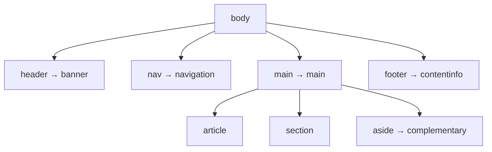
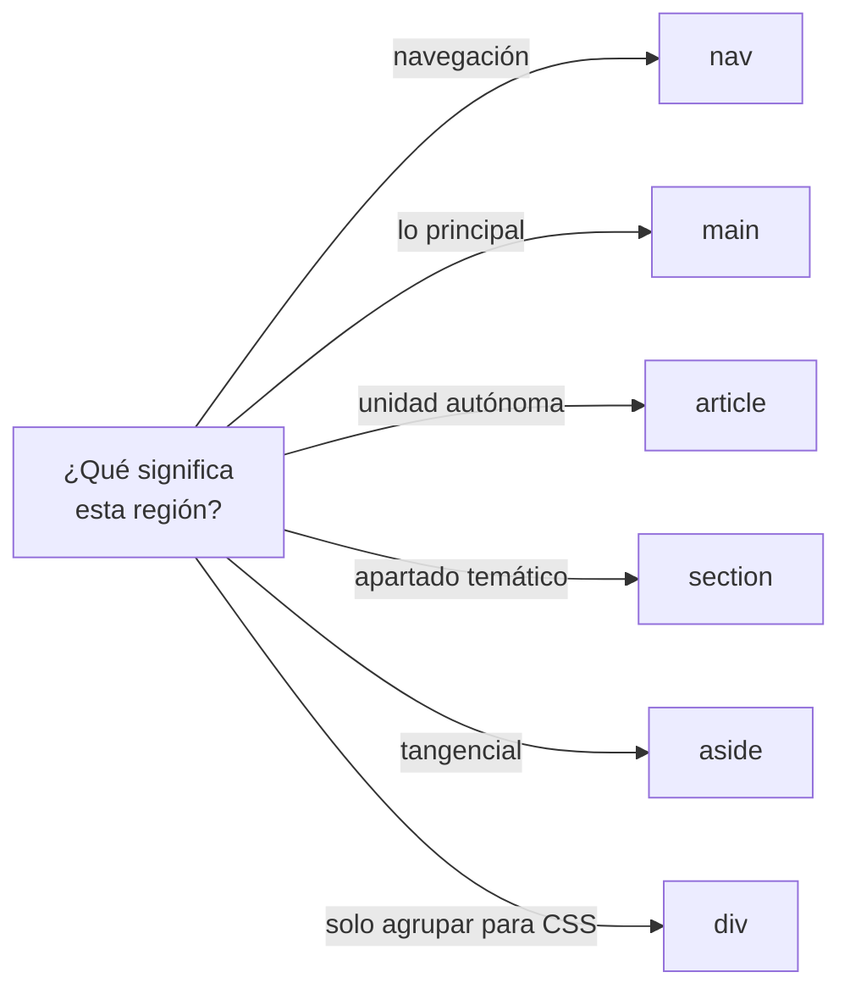

# Estructura Semántica

> [!definicion]
> Los elementos semánticos **nombran el rol** de cada región de la página (`<nav>`, `<main>`,
> `<article>`…) en lugar de usar `<div>` genéricos. El navegador, los buscadores y los lectores de
> pantalla **entienden** la estructura, no solo la dibujan. Es la diferencia entre un documento que
> es un árbol con significado y uno que es una sopa de cajas indistinguibles.

```html
<body>
  <header>…</header>
  <nav>…</nav>
  <main>
    <article>…</article>
    <aside>…</aside>
  </main>
  <footer>…</footer>
</body>
```

Visualmente, `<section>` y `<div>` se renderizan igual (bloques sin estilo). La diferencia es de
**significado**: un `<div>` no comunica nada; un `<nav>` declara "esto es navegación", y eso habilita
landmarks de accesibilidad, mejor SEO y un DOM legible sin una sola línea de CSS.

## Qué es un landmark

Un *landmark* es una región de la página con un rol reconocido (banner, navegación, contenido
principal, complementario, pie). Las tecnologías de asistencia construyen un **mapa de landmarks** que
permite al usuario saltar directamente a una región ("ir al contenido principal", "listar las
navegaciones") sin recorrer todo linealmente. Cada elemento semántico de nivel superior genera uno de
estos puntos de salto **gratis**.



## Mapa de la sección

Estructurales de página y agrupación:

- [[01 Encabezados Jerárquicos (h1-h6)]] — la jerarquía de títulos que forma el esquema.
- [[02 Agrupación de Título (hgroup)]] — título con subtítulo agrupados.
- [[03 Navegación (nav)]] — bloques de navegación.
- [[04 Contenido Principal (main)]] — el contenido central único.
- [[05 Secciones (section)]] — secciones temáticas con título.
- [[06 Artículos (article)]] — contenido autónomo y redistribuible.
- [[07 Contenido Complementario (aside)]] — contenido tangencial.
- [[08 Cabecera de Sección (header)]] — cabecera de página o de sección.
- [[09 Pie de Sección (footer)]] — pie de página o de sección.
- [[10 Dirección (address)]] — datos de contacto.
- [[11 Figura (figure, figcaption)]] — contenido referenciado con leyenda.

## El criterio central: semántica, no apariencia



La regla para elegir entre dos candidatos siempre es **el significado**, no cómo se ve:

| Pregunta | Si la respuesta es sí… |
|----------|------------------------|
| ¿Tendría sentido publicado por separado? | `<article>` |
| ¿Es un apartado del todo, con su título? | `<section>` |
| ¿Es navegación principal? | `<nav>` |
| ¿Es secundario al contenido central? | `<aside>` |
| ¿Solo agrupo para aplicar CSS o JS? | `<div>` (sin semántica) |

## La prueba del esquema

> [!tip] Cómo validar la semántica
> Quita todo el CSS de la página (en DevTools, deshabilita las hojas). Si el documento **sigue siendo
> navegable y comprensible** solo por su marcado —títulos jerárquicos, regiones identificables—, la
> semántica es correcta. Una pila de `<div class="header">`, `<div class="nav">` falla esta prueba:
> sin CSS no se distingue nada.

## div y span: el caso sin semántica

`<div>` (bloque) y `<span>` (en línea) son los elementos **neutros**: no significan nada y existen
para agrupar con fines de estilo o script cuando ningún elemento semántico aplica. No son "malos";
son la herramienta correcta cuando de verdad no hay rol semántico. El error es usarlos *en lugar* de
los semánticos disponibles.

## Beneficios concretos

> [!info] Qué se gana con la semántica
> - **Accesibilidad**: landmarks navegables y un esquema de encabezados para lectores de pantalla,
>   sin trabajo extra.
> - **SEO**: los buscadores entienden la estructura (qué es el contenido principal, qué es
>   navegación) y la aprovechan.
> - **Mantenibilidad**: el HTML se lee solo; `<article>` dice más que `<div class="post">`.
> - **Estilo por defecto coherente** y selectores CSS más estables (`main > article` en vez de
>   `.x > .y`).

## Notas relacionadas

- [[01 HTML Semántico como Base]] — la semántica vista desde la accesibilidad (sección A11Y).
- [[04 Cuerpo (body)]] — el contenedor de todos estos landmarks.
- [[01 Roles de Landmark]] — cómo se mapean estos elementos a roles ARIA.
