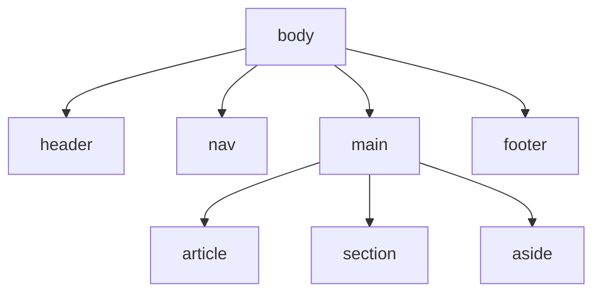

# Estructura Semántica

> [!definicion]
> Los elementos semánticos **nombran el rol** de cada región de la página (`<nav>`, `<main>`,
> `<article>`…) en lugar de usar [[01 Identificación (id, class) | `<div>`]] genéricos. El navegador,
> los buscadores y los lectores de pantalla **entienden** la estructura, no solo la dibujan.

```html
<body>
  <header>…</header>
  <nav>…</nav>
  <main>
    <article>…</article>
    <aside>…</aside>
  </main>
  <footer>…</footer>
</body>
```

Visualmente, `<section>` y `<div>` se renderizan igual (bloques sin estilo). La diferencia es de
**significado**: un `<div>` no dice nada; un `<nav>` declara "esto es navegación", y eso habilita
landmarks de accesibilidad y mejor SEO sin una línea de CSS.

## Mapa de landmarks



| Elemento | Rol | Nota |
|----------|-----|------|
| `<h1>`–`<h6>` | Jerarquía de títulos | [[01 Encabezados Jerárquicos (h1-h6)]] |
| `<hgroup>` | Título + subtítulo agrupados | [[02 Agrupación de Título (hgroup)]] |
| `<nav>` | Bloque de navegación | [[03 Navegación (nav)]] |
| `<main>` | Contenido principal único | [[04 Contenido Principal (main)]] |
| `<section>` | Sección temática con título | [[05 Secciones (section)]] |
| `<article>` | Contenido autónomo y redistribuible | [[06 Artículos (article)]] |
| `<aside>` | Contenido tangencial | [[07 Contenido Complementario (aside)]] |
| `<header>` | Cabecera de página o sección | [[08 Cabecera de Sección (header)]] |
| `<footer>` | Pie de página o sección | [[09 Pie de Sección (footer)]] |
| `<address>` | Datos de contacto | [[10 Dirección (address)]] |
| `<figure>` | Contenido referenciado con leyenda | [[11 Figura (figure, figcaption)]] |

> [!tip] La prueba del esquema
> Si al quitar todo el CSS la página sigue siendo navegable y comprensible solo por su marcado, la
> semántica es correcta. Una sopa de `<div>` falla esa prueba.

> [!info] Semántica = accesibilidad gratis
> Cada landmark semántico genera un punto de navegación para lectores de pantalla (saltar al `main`,
> listar regiones). Reproducir eso con `<div role="…">` es más trabajo y más frágil. Detalle en
> [[01 HTML Semántico como Base]].

## Notas relacionadas

- [[01 HTML Semántico como Base]] — la semántica desde la accesibilidad (A11Y).
- [[04 Cuerpo (body)]] — el contenedor de todos estos landmarks.
