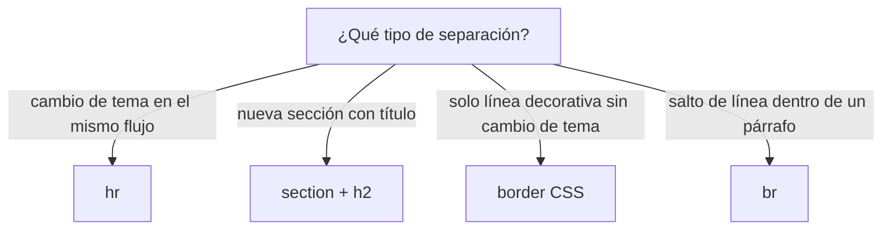

# Línea Horizontal (hr)

> [!definicion]
> `<hr>` representa un **cambio temático** a nivel de párrafo: un cambio de escena en una narración,
> un giro de tema dentro de una sección, una transición. El navegador lo dibuja como una línea
> horizontal, pero su significado es semántico, no decorativo. Es un elemento void.

```html
<p>…fin de la primera idea.</p>
<hr />
<p>Comienza un tema distinto…</p>
```

## De decorativo a semántico

`<hr>` cambió de significado entre versiones de HTML, y conviene tenerlo claro:

| Versión | Qué significaba | Atributos |
|---------|-----------------|-----------|
| HTML4 | Regla horizontal **decorativa** | `width`, `size`, `align`, `noshade` (hoy obsoletos) |
| HTML5 | **Separación temática** (cambio de tema) | Ninguno de presentación; estilo vía CSS |

La línea visible es solo su representación por defecto; lo que el elemento comunica es "aquí cambia el
tema". Su rol ARIA implícito es `separator`.

## Estilarlo con CSS

Como los atributos de presentación están obsoletos, el aspecto se controla con CSS. `<hr>` es un
elemento como cualquier otro:

```css
hr {
  border: none;
  height: 1px;
  background: linear-gradient(to right, transparent, #cba6f7, transparent);
  margin-block: 2rem;
}
```

## hr vs. otras separaciones



## Buenas prácticas

> [!tip] Recomendaciones
> - Usa `<hr>` cuando **de verdad** cambia el tema dentro de una misma sección de flujo.
> - Para una división mayor con su propio título, usa [[05 Secciones (section) | `<section>`]].
> - Para una línea puramente decorativa (un divisor de diseño sin cambio de contenido), usa un borde
>   CSS (`border-top`), no `<hr>`: así su rol `separator` se reserva para cambios reales.

## Errores comunes

> [!warning] hr como adorno
> Usar `<hr>` para meter una rayita decorativa cada vez que se quiere un divisor visual diluye su
> semántica. Si no hay cambio de tema, la línea es presentación y va en CSS. Y los atributos antiguos
> (`<hr width="50%">`) no deben usarse: están obsoletos.

## Notas relacionadas

- [[01 Párrafos (p)]] — los bloques de prosa que `<hr>` separa.
- [[05 Secciones (section)]] — para una división más fuerte, con título propio.
