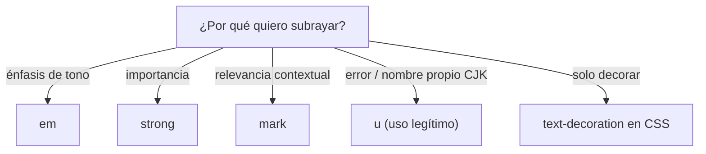

# Subrayado (u)

> [!definicion]
> `<u>` marca un fragmento con una **anotación no textual** que el navegador rinde como subrayado: típicamente un error ortográfico señalado por un corrector, o un nombre propio en escritura china (proper name mark). No es para subrayar por estética: es uno de los elementos de uso más limitado de HTML.

```html
<p>Has escrito <u>recivi</u> con una falta de ortografía.</p>
```

## El problema del subrayado en la web

| Contexto | Qué significa un subrayado |
|----------|----------------------------|
| Web | Convencionalmente, un **enlace** |
| Documento impreso | Énfasis o título |

En la web, el texto subrayado se asocia tan fuertemente con "enlace" que usar `<u>` puede llevar al usuario a intentar hacer clic. Por eso su uso real es marginal y casi siempre hay una opción mejor.

## Alternativas según la intención



`<u>` se reserva para cuando la anotación es **genuinamente no textual**: marcar un error de ortografía detectado, o un nombre propio en chino. Para todo lo demás, el elemento semántico correspondiente o CSS.

## Buenas prácticas

> [!tip] Recomendaciones
> - Evita `<u>` salvo en sus dos usos legítimos (error señalado, nombre propio CJK).
> - Si subrayas por diseño y no es un enlace, hazlo con CSS (`text-decoration: underline`) y diferéncialo visualmente de los enlaces (otro color, sin el estilo de link).
> - Nunca subrayes texto no enlazado que pueda parecer clicable.

## Errores comunes

> [!warning] u para "destacar"
> Usar `<u>` para resaltar texto crea la ilusión de un enlace roto: el usuario pasa el ratón o intenta tocar y no pasa nada. Para resaltar relevancia existe [[12 Texto Resaltado (mark) | `<mark>`]]; para importancia, `<strong>`; para énfasis, `<em>`.

## Notas relacionadas

- [[10 Tachado (s, del)]] — la anotación de "incorrecto / eliminado".
- [[12 Texto Resaltado (mark)]] — para resaltar por relevancia, sin confundir con enlaces.
- [[11 Texto Insertado (ins)]] — otro elemento que también se rinde subrayado.
