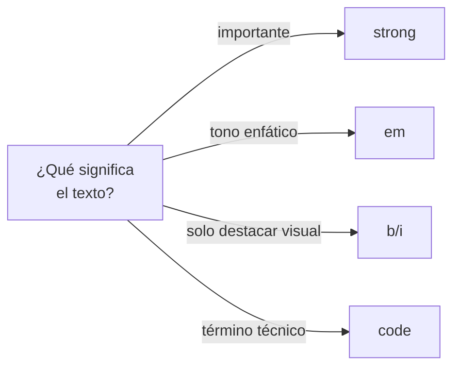

# Texto y Contenido

> [!definicion]
> Los elementos de texto marcan el **significado** de fragmentos dentro del flujo: un
> [[04 Énfasis Fuerte (strong) | énfasis]], una [[15 Abreviaturas (abbr) | abreviatura]], un
> [[17 Código (code) | fragmento de código]]. Se dividen en elementos de **bloque** (párrafos,
> citas largas) y **en línea** (dentro de un párrafo).

```html
<p>El agua hierve a <strong>100 °C</strong> a nivel del mar.
   Ver <abbr title="Organización Mundial de la Salud">OMS</abbr>.</p>
```

## Mapa de la sección

| Grupo | Elementos | Notas |
|-------|-----------|-------|
| Bloques base | `p`, `br`, `hr` | [[01 Párrafos (p)]], [[02 Saltos de Línea (br)]], [[03 Línea Horizontal (hr)]] |
| Énfasis e importancia | `strong`, `em`, `b`, `i` | [[04 Énfasis Fuerte (strong)]], [[05 Énfasis (em)]] |
| Estilo sin semántica fuerte | `small`, `u`, `s`/`del`, `ins`, `mark` | [[08 Texto Pequeño (small)]], [[12 Texto Resaltado (mark)]] |
| Citas | `blockquote`, `q` | [[13 Citas en Bloque (blockquote)]], [[14 Citas en Línea (q)]] |
| Términos | `abbr`, `dfn` | [[15 Abreviaturas (abbr)]], [[16 Definiciones (dfn)]] |
| Código y técnica | `code`, `pre`, `var`, `samp`, `kbd` | [[17 Código (code)]], [[18 Código Preformateado (pre)]] |
| Notación | `sup`/`sub`, `time` | [[22 Superíndice y Subíndice (sup, sub)]], [[23 Tiempo (time)]] |
| Internacionalización | `bdo`/`bdi`, `wbr` | [[24 Texto Bidireccional (bdo, bdi)]], [[25 Ruptura de Palabra (wbr)]] |

## El criterio central: semántica, no apariencia



Varios pares se ven igual pero significan cosas distintas: `<strong>`/`<b>` ambos en negrita,
`<em>`/`<i>` ambos en cursiva. La etiqueta correcta es la que describe **por qué** ese texto es
especial, no cómo se ve. Lo visual se cambia con CSS; el significado, no.

> [!tip] La regla del lector de pantalla
> Si un texto debe **sonar** distinto al leerse en voz alta (más fuerte, con otro tono), usar
> `<strong>`/`<em>`. Si solo debe **verse** distinto sin cambio de voz, usar `<b>`/`<i>` o, mejor,
> una clase CSS.

## Notas relacionadas

- [[04 Énfasis Fuerte (strong)]] — el caso central de semántica vs. apariencia.
- [[17 Código (code)]] — marcado de contenido técnico.
