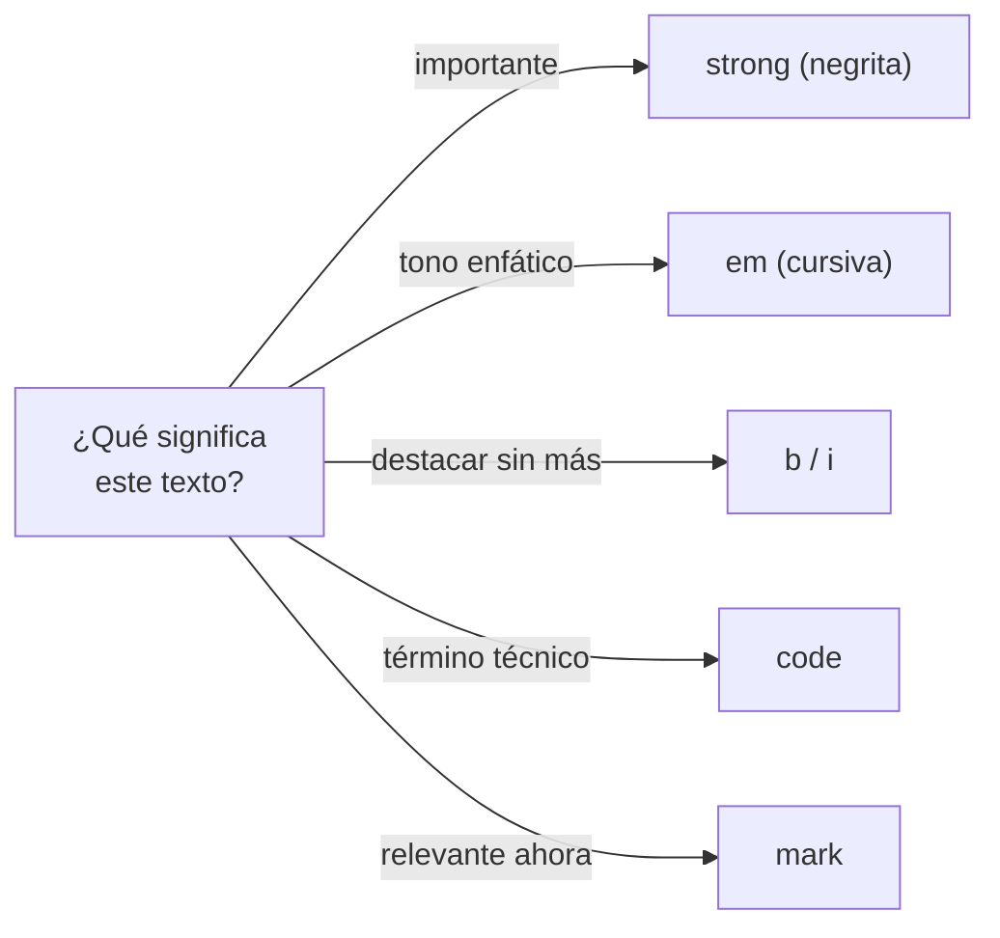

# Texto y Contenido

> [!definicion]
> Los elementos de texto marcan el **significado** de fragmentos dentro del flujo: un énfasis, una
> abreviatura, un fragmento de código, una cita. Se dividen en elementos de **bloque** (párrafos,
> citas largas, líneas separadoras) y **en línea** (que viven dentro de un párrafo sin romperlo).

```html
<p>El agua hierve a <strong>100 °C</strong> a nivel del mar, según la
   <abbr title="Organización Mundial de la Salud">OMS</abbr>. La fórmula es
   <var>T</var> = 100 °C.</p>
```

## El criterio central: semántica, no apariencia

Varios elementos se ven igual pero significan cosas distintas. La etiqueta correcta describe **por
qué** un texto es especial, no cómo se ve; la apariencia se ajusta luego con CSS.



| Par que se confunde | Ambos se ven | La diferencia |
|---------------------|--------------|---------------|
| `strong` vs `b` | Negrita | Importancia semántica vs. solo resaltar |
| `em` vs `i` | Cursiva | Énfasis de tono vs. convención tipográfica |
| `s` vs `del` | Tachado | Ya no aplica vs. eliminado en una edición |
| `q` vs `blockquote` | Cita | Corta en línea vs. larga en bloque |

> [!tip] La regla del lector de pantalla
> Si un texto debe **sonar** distinto al leerse en voz alta (más fuerte, con otro tono), usa
> `strong`/`em`. Si solo debe **verse** distinto sin cambio de voz, usa `b`/`i` o, mejor, una clase
> CSS. La voz es la frontera entre lo semántico y lo decorativo.

## Mapa de la sección

Bloques base:

- [[01 Párrafos (p)]] · [[02 Saltos de Línea (br)]] · [[03 Línea Horizontal (hr)]]

Énfasis e importancia (semántico vs. visual):

- [[04 Énfasis Fuerte (strong)]] · [[05 Énfasis (em)]] · [[06 Negrita sin Énfasis (b)]] · [[07 Cursiva sin Énfasis (i)]]

Estilo y anotaciones:

- [[08 Texto Pequeño (small)]] · [[09 Subrayado (u)]] · [[10 Tachado (s, del)]] · [[11 Texto Insertado (ins)]] · [[12 Texto Resaltado (mark)]]

Citas y términos:

- [[13 Citas en Bloque (blockquote)]] · [[14 Citas en Línea (q)]] · [[15 Abreviaturas (abbr)]] · [[16 Definiciones (dfn)]]

Código y técnica:

- [[17 Código (code)]] · [[18 Código Preformateado (pre)]] · [[19 Variable (var)]] · [[20 Salida de Programa (samp)]] · [[21 Entrada de Teclado (kbd)]]

Notación e internacionalización:

- [[22 Superíndice y Subíndice (sup, sub)]] · [[23 Tiempo (time)]] · [[24 Texto Bidireccional (bdo, bdi)]] · [[25 Ruptura de Palabra (wbr)]]

## Elementos de bloque vs. en línea

Una distinción transversal que conviene tener clara:

| Tipo | Comportamiento | Ejemplos |
|------|----------------|----------|
| Bloque | Ocupan su propia línea, apilan verticalmente | `p`, `blockquote`, `pre`, `hr`, `figure` |
| En línea (fraseo) | Fluyen dentro del texto, no rompen línea | `strong`, `em`, `a`, `code`, `abbr`, `mark` |

Esta es una clasificación de **comportamiento por defecto**; CSS puede cambiarla con `display`, pero
la categoría semántica del elemento (qué puede contener, dónde puede anidar) no cambia.

## Notas relacionadas

- [[04 Énfasis Fuerte (strong)]] — el caso central de semántica vs. apariencia.
- [[17 Código (code)]] — el marcado de contenido técnico.
- [[02 Estructura Semántica/index]] — los elementos de estructura, nivel por encima del texto.
