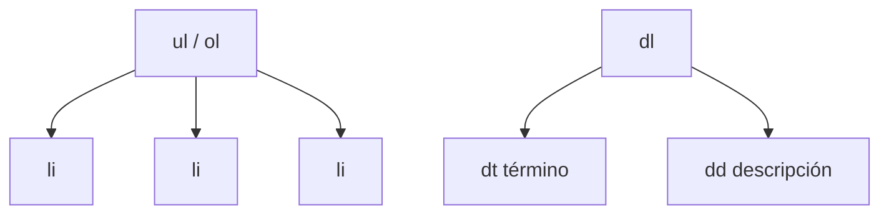

# Listas

> [!definicion]
> Las listas agrupan **elementos relacionados** dándoles estructura semántica: el navegador y los lectores de pantalla saben cuántos elementos hay y cómo se relacionan. HTML ofrece tres tipos según la relación entre los ítems: ordenada, no ordenada y de definición.

```html
<ul>
  <li>Manzanas</li>
  <li>Peras</li>
  <li>Plátanos</li>
</ul>
```

## Los tres tipos de lista

| Tipo | Elemento | Cuándo | El orden importa |
|------|----------|--------|------------------|
| No ordenada | `<ul>` | Conjunto de ítems sin secuencia | No |
| Ordenada | `<ol>` | Pasos, ranking, secuencia numerada | Sí |
| De definición | `<dl>` | Pares término–descripción | — |

El detalle de cada una: [[02 Listas No Ordenadas (ul) | ul]], [[01 Listas Ordenadas (ol) | ol]] y [[04 Listas de Definición (dl, dt, dd) | dl]].

## La estructura es padre + hijos

Todas las listas comparten un patrón: un **contenedor** (`<ul>`, `<ol>`, `<dl>`) que solo puede contener sus **ítems** directos (`<li>`, o `<dt>`/`<dd>`):



No se puede meter texto suelto directamente en un `<ul>`: todo hijo directo debe ser un [[03 Elementos de Lista (li) | `<li>`]]. Lo demás va dentro del `<li>`.

## Mapa de la sección

- [[01 Listas Ordenadas (ol)]] — secuencias numeradas, con `type`, `start`, `reversed`.
- [[02 Listas No Ordenadas (ul)]] — conjuntos sin orden, con viñetas.
- [[03 Elementos de Lista (li)]] — el ítem, común a `<ul>` y `<ol>`.
- [[04 Listas de Definición (dl, dt, dd)]] — pares término–descripción.
- [[05 Listas Anidadas]] — listas dentro de listas y sus reglas.

## Por qué usar listas y no párrafos con guiones

> [!info] El valor semántico
> Visualmente, una lista con viñetas se puede imitar con párrafos y caracteres `•`. Pero una `<ul>` real aporta lo que el texto plano no:
> - El lector de pantalla anuncia "lista de 3 elementos" y permite navegarla ítem a ítem.
> - El número de elementos y su relación quedan explícitos en el DOM.
> - El estilo (viñetas, numeración, sangría) se controla con CSS de forma coherente.
>
> Las listas son, además, la estructura idiomática de los **menús de navegación** ([[03 Navegación (nav) | `<nav>`]]).

## Notas relacionadas

- [[02 Listas No Ordenadas (ul)]] — el tipo más común.
- [[03 Navegación (nav)]] — los menús se construyen con listas.
