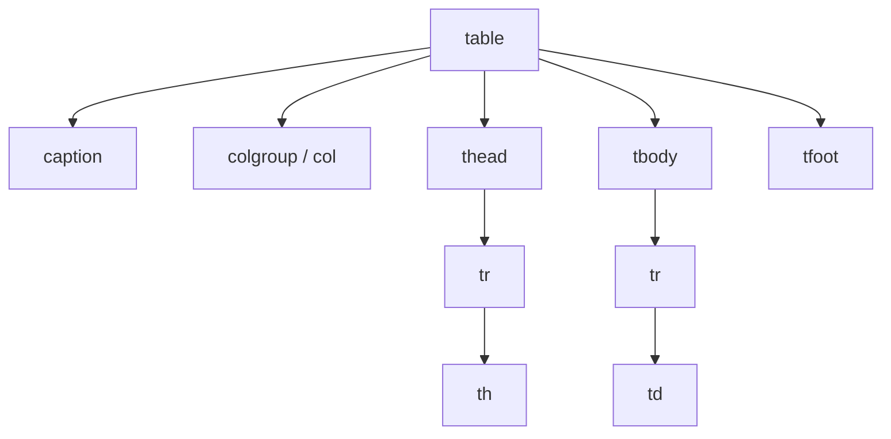

# Tablas

> [!definicion]
> Una tabla HTML representa **datos tabulares**: información que tiene sentido organizada en filas y columnas, donde la posición de cada celda (qué fila, qué columna) aporta significado. La construye un [[01 Contenedor de Tabla (table) | `<table>`]] con filas [[02 Fila de Tabla (tr) | `<tr>`]] que contienen celdas de encabezado [[03 Celda de Encabezado (th) | `<th>`]] o de datos [[04 Celda de Datos (td) | `<td>`]].

```html
<table>
  <caption>Ventas por trimestre</caption>
  <thead>
    <tr><th>Trimestre</th><th>Ventas</th></tr>
  </thead>
  <tbody>
    <tr><td>Q1</td><td>12.000 €</td></tr>
    <tr><td>Q2</td><td>15.500 €</td></tr>
  </tbody>
</table>
```

## Anatomía completa



| Elemento | Función |
|----------|---------|
| `<table>` | El contenedor de toda la tabla |
| `<caption>` | El título visible de la tabla |
| `<colgroup>` / `<col>` | Agrupar y estilar columnas |
| `<thead>` / `<tbody>` / `<tfoot>` | Secciones: cabecera, cuerpo, pie |
| `<tr>` | Una fila |
| `<th>` | Celda de encabezado (de fila o columna) |
| `<td>` | Celda de datos |

Cada uno tiene su nota: [[01 Contenedor de Tabla (table) | table]], [[02 Fila de Tabla (tr) | tr]], [[03 Celda de Encabezado (th) | th]], [[04 Celda de Datos (td) | td]], [[05 Fusión de Celdas (colspan, rowspan) | fusión]], [[06 Agrupación de Columnas (colgroup, col) | colgroup]], [[07 Secciones (thead, tbody, tfoot) | secciones]] y [[08 Título de Tabla (caption) | caption]].

## La regla de oro: tablas para datos, no para maquetar

> [!warning] Las tablas no son para diseño
> Antes de CSS, las tablas se usaban para maquetar páginas enteras (columnas, rejillas). **Eso está obsoleto y es perjudicial**: rompe la accesibilidad (un lector de pantalla anuncia "tabla de 30 filas" sobre un layout que no es una tabla) y es rígido. El diseño de columnas y rejillas se hace hoy con [[03 Flexbox/index | Flexbox]] y Grid en CSS. Una `<table>` solo se usa para **datos genuinamente tabulares**.

## Por qué importa la semántica de tabla

Una tabla bien construida permite a los lectores de pantalla **asociar cada celda con sus encabezados** ("fila Q1, columna Ventas: 12.000 €"). Eso depende de usar `<th>` con `scope` correctamente, no `<td>` para todo. Una tabla maquetada con solo `<td>` es un muro de datos sin contexto para quien no la ve.

## Notas relacionadas

- [[01 Contenedor de Tabla (table)]] — el punto de partida.
- [[03 Celda de Encabezado (th)]] — la clave de la accesibilidad de tablas.
- [[03 Flexbox/index]] — para maquetar (no usar tablas).
