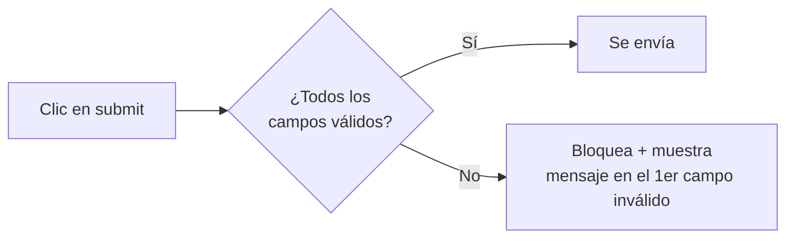

# Validación Nativa HTML5

> [!definicion]
> La validación nativa es la que el **navegador realiza solo**, sin JavaScript, a partir de los atributos de los controles (`required`, `type`, `pattern`, `min`/`max`…). Al intentar enviar, el navegador bloquea el envío si algún campo no cumple y muestra un mensaje de error junto a él.

```html
<form>
  <input type="email" required />
  <button type="submit">Enviar</button>
</form>
<!-- Si el email está vacío o mal formado, el navegador impide el envío -->
```

## Cómo funciona el flujo



El navegador comprueba cada control, y si encuentra uno inválido, **detiene el envío**, lo enfoca y muestra un globo con el mensaje de error correspondiente.

## Desactivarla: novalidate

| Dónde | Atributo | Efecto |
|-------|----------|--------|
| En el `<form>` | `novalidate` | Desactiva la validación nativa de todo el formulario |
| En el botón | `formnovalidate` | Ese botón envía sin validar (p. ej. "Guardar borrador") |

```html
<form novalidate>…</form>
```

Se desactiva cuando se quiere validar **enteramente con JavaScript** (para controlar los mensajes y el momento), pero entonces la validación pasa a ser responsabilidad del código.

## Personalizar los mensajes

Los mensajes por defecto ("Rellena este campo") no se pueden estilar ni traducir con HTML, pero sí cambiar su texto con JavaScript a través de [[05 Constraint Validation API | `setCustomValidity()`]]:

```js
campo.setCustomValidity("Introduce un correo de empresa.");
```

El atributo `title` complementa a [[02 Atributo pattern | `pattern`]]: su texto aparece en el mensaje cuando el patrón no se cumple.

## Ventajas y límites

> [!info] Qué aporta y qué no
> **Aporta**: feedback inmediato sin código, accesible, gratis, consistente con el navegador del usuario.
> **No aporta**: control total del aspecto de los mensajes (limitado), ni validaciones complejas entre campos (que la contraseña coincida con su confirmación requiere JS), ni seguridad (es saltable). Para esos casos se combina con la [[05 Constraint Validation API | API de validación]].

## Buenas prácticas

> [!tip] Recomendaciones
> - Aprovecha la validación nativa como primera capa: `type`, `required`, `pattern`, longitudes.
> - Usa `title` para explicar el formato esperado de un `pattern`.
> - Para mensajes a medida o reglas entre campos, complementa con la Constraint Validation API.
> - **Revalida siempre en el servidor**: la nativa es saltable.

## Errores comunes

> [!warning] Trampas
> - **Confiar solo en ella**: se desactiva con `novalidate` o sin JS; no es seguridad.
> - **`novalidate` sin sustituir la validación**: deja el formulario sin ninguna comprobación de cliente.
> - **Mensajes por defecto poco claros** sin personalizar cuando el campo es complejo.

## Notas relacionadas

- [[03 Restricciones (required, min, max, step, maxlength)]] — los atributos que validan.
- [[04 Pseudoclases de Validación]] — estilar el estado válido/inválido.
- [[05 Constraint Validation API]] — control desde JavaScript.
