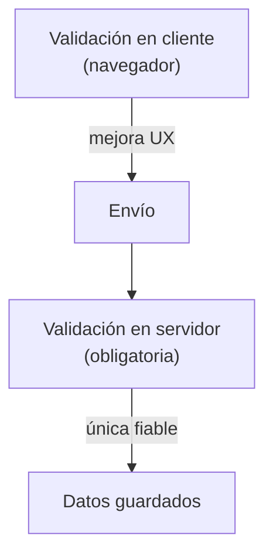

# Validación de Formularios

> [!definicion]
> La validación comprueba que los datos introducidos cumplen las reglas esperadas **antes** de enviarlos. HTML5 ofrece validación **nativa** (sin JavaScript) mediante atributos como `required`, `type` y `pattern`, complementada por una API JavaScript para casos a medida.

```html
<input type="email" required minlength="5" />
<input type="text" pattern="[0-9]{5}" title="5 dígitos" required />
```

## Las capas de validación



| Capa | Dónde | Para qué | ¿Suficiente? |
|------|-------|----------|--------------|
| Cliente (nativa/JS) | Navegador | Feedback inmediato, mejor UX | No, es saltable |
| Servidor | Backend | Seguridad e integridad | **Sí, obligatoria** |

> [!warning] El cliente nunca basta
> La validación del navegador se puede saltar (desactivando JS, con `novalidate`, o enviando la petición a mano). **Todo dato debe revalidarse en el servidor.** La validación de cliente mejora la experiencia; la de servidor protege los datos. Nunca confíes solo en la primera.

## Mapa de la sección

- [[01 Validación Nativa HTML5]] — el sistema de validación del navegador y sus mensajes.
- [[02 Atributo pattern]] — validar formato con expresiones regulares.
- [[03 Restricciones (required, min, max, step, maxlength)]] — los atributos de restricción.
- [[04 Pseudoclases de Validación]] — estilar campos válidos/ inválidos con CSS.
- [[05 Constraint Validation API]] — control fino de la validación desde JavaScript.

## Las piezas de la validación nativa

| Mecanismo | Qué valida |
|-----------|------------|
| `type` | Formato implícito (email, url, number…) |
| `required` | Que el campo no quede vacío |
| `min`/`max`/`step` | Rango y granularidad numérica/fecha |
| `minlength`/`maxlength` | Longitud del texto |
| `pattern` | Una expresión regular a medida |

## Notas relacionadas

- [[01 Validación Nativa HTML5]] — el punto de partida.
- [[02 Validación Específica por Tipo]] — la validación que aporta cada `type`.
- [[01 Contenedor de Formulario (form)]] — `novalidate` y el envío.
