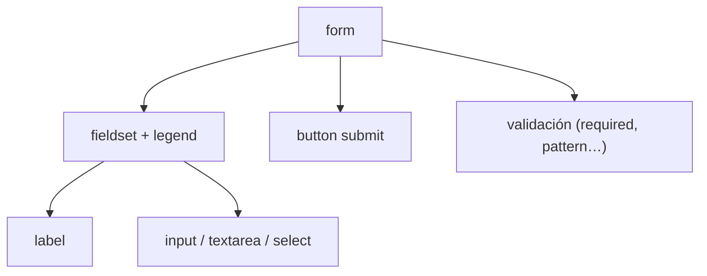

# Formularios

> [!definicion]
> Un formulario captura **datos del usuario** y normalmente los envía a un servidor para procesarlos: un login, un registro, una búsqueda, un pago. El [[01 Contenedor de Formulario (form) | `<form>`]] agrupa los controles ([[02 Campos de Entrada (input)/index | `<input>`]], [[03 Área de Texto (textarea) | `<textarea>`]], [[04 Listas de Selección (select)/index | `<select>`]]…), cada uno etiquetado con un [[07 Etiquetas y Agrupación/01 Etiqueta de Campo (label) | `<label>`]].

```html
<form action="/registro" method="post">
  <label for="email">Correo</label>
  <input type="email" id="email" name="email" required />
  <button type="submit">Registrarse</button>
</form>
```

## Anatomía de un formulario



## Mapa de la sección

- [[01 Contenedor de Formulario (form)]] — el `<form>` y sus atributos (`action`, `method`, `enctype`…).
- [[02 Campos de Entrada (input)/index]] — el `<input>`, sus atributos comunes y sus 22 tipos.
- [[03 Área de Texto (textarea)]] — texto multilínea.
- [[04 Listas de Selección (select)/index]] — desplegables (`select`, `option`, `optgroup`).
- [[05 Lista de Datos (datalist)]] — sugerencias de autocompletado.
- [[06 Botones (button)]] — botones de envío, reinicio y acción.
- [[07 Etiquetas y Agrupación/index]] — `label`, `fieldset`, `legend`.
- [[08 Elementos de Salida/index]] — `output`, `meter`, `progress`.
- [[09 Validación de Formularios/index]] — validación nativa, `pattern`, restricciones, API.

## Los tres pilares de un formulario usable

| Pilar | Cómo se logra |
|-------|---------------|
| **Etiquetado** | Cada control con su `<label for>` asociado |
| **Validación** | `required`, `type`, `pattern`, restricciones nativas |
| **Envío** | `action` + `method` correctos, o manejo con JavaScript |

## name: la clave de los datos enviados

> [!info] Sin name no se envía
> El atributo `name` de cada control es **fundamental**: es la clave bajo la que su valor viaja al servidor. Un `<input>` sin `name` **no se envía**. Los datos llegan como pares `name=valor`:
> ```
> email=ana@x.com&password=1234
> ```
> Por eso `name` (qué dato es) es distinto de `id` (para asociar el `<label>` y para CSS/JS). Un control suele necesitar ambos.

## La accesibilidad empieza en el label

> [!tip] Todo control necesita su label
> El error más común y más grave en formularios es dejar controles sin etiqueta asociada. Sin `<label>`, un lector de pantalla no sabe qué pide el campo, y el área clicable se reduce al propio control. El `<label for="id">` (o envolver el control) es el cimiento de un formulario accesible. Detalle en [[07 Etiquetas y Agrupación/01 Etiqueta de Campo (label) | `<label>`]].

## Notas relacionadas

- [[01 Contenedor de Formulario (form)]] — el contenedor y el envío.
- [[02 Campos de Entrada (input)/index]] — el control más versátil.
- [[09 Validación de Formularios/index]] — asegurar datos correctos antes de enviar.
