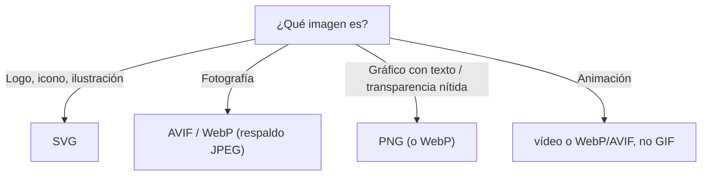

# Formatos de Imagen

> [!definicion]
> Elegir el **formato** adecuado para cada imagen es clave para el rendimiento y la calidad. Cada formato tiene fortalezas: fotos, transparencia, animación, vectores. Un formato mal elegido pesa de más o pierde calidad.

## Comparativa

| Formato | Tipo | Transparencia | Mejor para | Notas |
|---------|------|---------------|------------|-------|
| **JPEG** | Raster, con pérdida | No | Fotografías | Compresión alta; artefactos en bordes nítidos |
| **PNG** | Raster, sin pérdida | Sí (alfa) | Logos, capturas, gráficos con texto | Pesado para fotos |
| **GIF** | Raster, paleta 256 | Sí (binaria) | Animaciones simples | Obsoleto; usar vídeo o WebP/AVIF |
| **SVG** | Vectorial | Sí | Logos, iconos, ilustraciones | Escala infinito; es código |
| **WebP** | Raster, con/sin pérdida | Sí | Casi todo (reemplaza JPEG/PNG) | ~30 % menos peso que JPEG |
| **AVIF** | Raster, con/sin pérdida | Sí | Fotos de alta compresión | El más eficiente; soporte creciente |

## Cómo elegir



## Los modernos: WebP y AVIF

> [!tip] Prefiere WebP/AVIF con respaldo
> **WebP** y **AVIF** comprimen mucho mejor que JPEG/PNG manteniendo calidad, reduciendo el peso de las imágenes (lo que más tarda en cargar). Como el soporte de AVIF aún no es universal, se sirven con respaldo usando [[02 Imágenes Responsivas (picture, source) | `<picture>`]]:
> ```html
> <picture>
>   <source srcset="foto.avif" type="image/avif" />
>   <source srcset="foto.webp" type="image/webp" />
>   
> </picture>
> ```
> El navegador toma el primer formato que entiende, cayendo a JPEG si hace falta.

## GIF está obsoleto para animación

> [!warning] No uses GIF para animaciones
> El GIF animado pesa enormemente y tiene solo 256 colores. Para animaciones, un **vídeo** (`<video>` con `autoplay muted loop`) o WebP/AVIF animados pesan una fracción y se ven mejor. El GIF solo sobrevive por inercia cultural.

## SVG: el caso especial

El [[02 Gráficos Vectoriales (svg) | SVG]] es vectorial (código, no píxeles): escala sin perder nitidez, ideal para logos e iconos, y puede animarse y estilarse con CSS. No compite con las fotos (donde el raster gana), sino con los gráficos geométricos.

## Buenas prácticas

> [!tip] Recomendaciones
> - Fotos → AVIF/WebP con respaldo JPEG vía `<picture>`.
> - Logos, iconos, ilustraciones → SVG.
> - Gráficos con transparencia nítida → PNG o WebP.
> - Animaciones → vídeo, no GIF.
> - Comprime y dimensiona las imágenes al tamaño real de uso.

## Errores comunes

> [!warning] Trampas
> - **PNG para fotos**: pesa mucho más que JPEG/WebP.
> - **GIF para animación**: enorme y de baja calidad.
> - **Imágenes sin comprimir** o servidas a mayor resolución de la necesaria.
> - **SVG para fotografías**: no es su terreno (es vectorial).

## Notas relacionadas

- [[01 Imagen (img)]] — el elemento que muestra estos formatos.
- [[02 Imágenes Responsivas (picture, source)]] — servir formatos modernos con respaldo.
- [[02 Gráficos Vectoriales (svg)]] — el formato vectorial en detalle.
