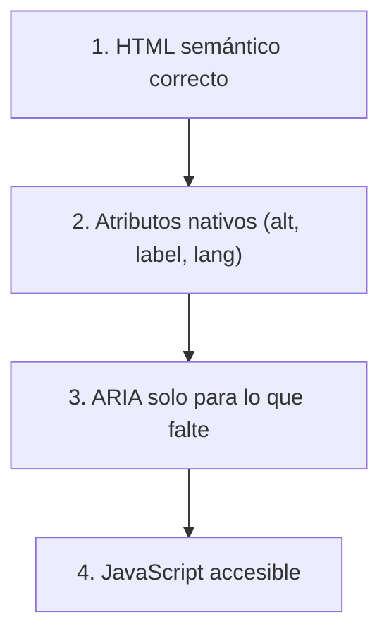

# HTML Semántico como Base

> [!definicion]
> La mayor parte de la accesibilidad web se consigue **usando el elemento HTML correcto** para cada cosa. El marcado semántico viene con accesibilidad **incorporada**: roles, navegación por teclado, anuncios del lector de pantalla. Recrear eso con `<div>` y ARIA es más trabajo y más frágil.

```html
<!-- ✅ accesible por defecto -->
<button>Enviar</button>

<!-- ❌ hay que añadir rol, teclado y foco a mano, y aun así queda peor -->
<div onclick="enviar()">Enviar</div>
```

## Qué aporta cada elemento "gratis"

| Elemento nativo | Accesibilidad incorporada |
|-----------------|---------------------------|
| `<button>` | Rol `button`, foco, activación con Enter/Espacio |
| `<a href>` | Rol `link`, foco, navegación |
| `<input>` + `<label>` | Asociación, anuncio del propósito, área clicable |
| `<h1>`–`<h6>` | Esquema navegable por encabezados |
| `<nav>`, `<main>`… | Landmarks con puntos de salto |
| `<table>` con `<th>` | Asociación celda–encabezado |

Todo esto funciona **sin una línea de JavaScript ni ARIA**.

## El coste de no usar semántica

> [!warning] El div genérico no comunica nada
> Un `<div>` (o `<span>`) no tiene rol, no recibe foco por teclado, y el lector de pantalla lo anuncia como texto plano. Construir un "botón" o un "enlace" con `<div>` obliga a:
> - Añadir `role="button"` (o `link`).
> - Añadir `tabindex="0"` para el foco.
> - Manejar `keydown` para Enter/Espacio con JavaScript.
> - Replicar estados (`aria-pressed`, `aria-disabled`).
>
> Y aun así, suele comportarse peor que el elemento nativo (no abre en pestaña nueva con Ctrl+clic, no respeta preferencias del sistema…). Es mucho trabajo para un resultado inferior.

## La pirámide de la accesibilidad



Se construye de abajo arriba: primero la base semántica, y solo se sube a ARIA o JS cuando el HTML no llega.

## Buenas prácticas

> [!tip] Recomendaciones
> - Pregúntate siempre: *¿existe un elemento HTML para esto?* Si sí, úsalo.
> - Botones para acciones, enlaces para navegar, encabezados para títulos, listas para listas.
> - Reserva `<div>`/`<span>` para agrupar por estilo, sin semántica.
> - Recurre a ARIA solo cuando el HTML no ofrezca el patrón (un componente complejo a medida).

## Errores comunes

> [!warning] Trampas
> - **`<div>` clicables** como botones: inaccesibles por teclado.
> - **Encabezados elegidos por tamaño** en vez de jerarquía.
> - **Sopa de `<div>`** que sin CSS no se entiende.
> - **ARIA para recrear** lo que un elemento nativo ya hace.

## Notas relacionadas

- [[02 Estructura Semántica/index]] — los landmarks semánticos.
- [[02 ARIA/index]] — cuándo (y cuándo no) recurrir a ARIA.
- [[06 Botones (button)]] — el ejemplo canónico de "botón nativo vs. div".
