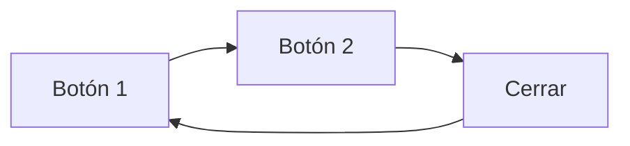

# Trampas de Foco (focus trapping)

> [!definicion]
> Una **trampa de foco** mantiene el foco del teclado **dentro** de un componente mientras está activo. Es deseable y necesaria en un **modal**: mientras el diálogo está abierto, `Tab` no debe escaparse al contenido de fondo. Pero una trampa **accidental** —de la que no se puede salir— es uno de los peores fallos de accesibilidad.



## La trampa buena: el modal

> [!info] Un modal debe atrapar el foco a propósito
> Cuando se abre un diálogo modal, el contenido de detrás queda inerte. Para coherencia, el foco del teclado debe **quedar confinado** dentro del modal: al pulsar `Tab` en el último elemento, el foco vuelve al primero (y `Shift+Tab` en el primero va al último), en bucle. Sin esta trampa, el usuario de teclado "tabula" hacia el fondo invisible y se pierde. Un modal accesible requiere:
> - **Atrapar** el foco dentro mientras está abierto.
> - Cerrarse con `Esc`.
> - **Devolver** el foco al elemento que lo abrió al cerrar (ver [[02 Gestión de Foco (focus, blur) | gestión de foco]]).

El elemento [[01 Marco en Línea (iframe) | nativo]] `<dialog>` (con `showModal()`) implementa esta trampa **automáticamente**, lo que lo hace muy preferible a un modal a medida.

## La trampa mala: quedarse atrapado

> [!warning] La trampa accidental es crítica
> Una trampa de foco **no intencionada** —un widget mal hecho del que el `Tab` no puede salir— deja al usuario de teclado **encerrado**, sin forma de seguir navegando salvo recargar. Es un fallo de nivel A de las WCAG (2.1.2, "Sin trampas de teclado"). Causas típicas:
> - Un componente de terceros (un reproductor, un editor) que captura el `Tab` y no lo libera.
> - Un manejador de teclado que hace `preventDefault()` sin dejar salida.
>
> La regla: el foco siempre debe poder **entrar y salir** de cualquier componente con el teclado, salvo en un modal activo (que es una trampa deliberada y con salida vía `Esc`).

## dialog nativo: la solución recomendada

```html
<dialog id="modal">
  <h2>Confirmar</h2>
  <button onclick="modal.close()">Cerrar</button>
</dialog>
```

```js
modal.showModal();   // abre como modal: atrapa el foco y permite Esc, automáticamente
```

`<dialog>` con `showModal()` gestiona la trampa, el `Esc` y el fondo inerte sin código manual.

## Buenas prácticas

> [!tip] Recomendaciones
> - Para modales, usa `<dialog>` + `showModal()`: la trampa correcta, gratis.
> - Si construyes un modal a medida, atrapa el foco, cierra con `Esc` y devuelve el foco al cerrar.
> - Verifica que **ningún** otro componente atrapa el foco por error: tabula por toda la página.
> - Nunca dejes un widget del que el teclado no pueda salir.

## Errores comunes

> [!warning] Trampas
> - **Trampa accidental**: un componente que no suelta el `Tab` (fallo grave).
> - **Modal sin trampa**: el foco se va al fondo invisible.
> - **Modal sin `Esc`** o que no devuelve el foco al cerrar.

## Notas relacionadas

- [[02 Gestión de Foco (focus, blur)]] — mover y devolver el foco.
- [[01 tabindex]] — el control del orden de foco.
- [[03 Roles de Widget]] — el rol `dialog` y los modales.
