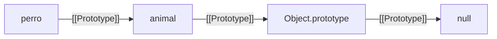

# Prototipos

> [!definicion]
> Cada objeto en JavaScript tiene un slot interno `[[Prototype]]` que apunta a otro objeto (o a `null`). Cuando se accede a una propiedad que no existe en el objeto propio, el motor la busca en `[[Prototype]]`, luego en el `[[Prototype]]` de ese, y así sucesivamente hasta llegar a `null`. Esa cadena de referencias es el **sistema de herencia de JavaScript** — sin clases, sin copia de propiedades: pura delegación en tiempo de ejecución.

```js
const animal = { hablar() { return `${this.nombre} habla`; } };
const perro = Object.create(animal);
perro.nombre = "Rex";

perro.hablar(); // "Rex habla"
// perro no tiene 'hablar' → motor sube a animal → lo encuentra → ejecuta con this=perro
```

## El mecanismo central

La cadena de prototipos es el sustrato sobre el que se construye todo lo demás en JS: `class`, `new`, `instanceof`, `for...in`. Antes de ES6, era la única forma de herencia; hoy sigue siendo **lo que `class` hace por dentro**.

El final de toda cadena es `Object.prototype` (con `toString`, `hasOwnProperty`, `valueOf`). Su `[[Prototype]]` es `null`. Arrays añaden `Array.prototype` antes de `Object.prototype`; funciones añaden `Function.prototype`.



## Notas de esta sección

| Nota | Qué cubre |
|---|---|
| 01 Cadena de Prototipos | Cómo el motor recorre el slot interno hasta `null`; shadowing; algoritmo Get |
| 02 getPrototypeOf y setPrototypeOf | API estándar para leer y escribir el prototipo; coste de `setPrototypeOf` |
| 03 Propiedades Propias vs Heredadas | `Object.hasOwn`, `hasOwnProperty`, `Object.keys`, `for...in`; tabla comparativa |
| 04 Object.create() | Crear objetos con prototipo explícito; `Object.create(null)`; segundo argumento |
| 05 Funciones Constructoras (new, this) | Los 4 pasos de `new`; `F.prototype`; `constructor`; métodos compartidos vs por instancia |
| 06 Herencia Prototípica | Patrón clásico pre-ES6; `Object.create` + `.call`; por qué restaurar `.constructor` |

## Notas relacionadas

- [[02 Programación Orientada a Objetos/index | POO en JavaScript]]
- [[01 Cadena de Prototipos]]
- [[04 Object.create()]]
- [[05 Funciones Constructoras (new, this)]]
- [[06 Herencia Prototípica]]
- [[03 Clases/index | Clases (azúcar sintáctico sobre prototipos)]]
