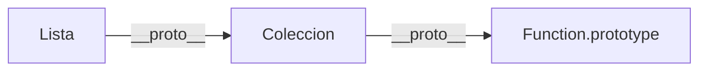

# Métodos y Propiedades Estáticas

> [!definicion]
> Los miembros declarados con `static` pertenecen a la **clase** (la función constructora) y no a las instancias. Se acceden como `Clase.miembro`, no como `instancia.miembro`. El `this` dentro de un método estático hace referencia a la clase, no a ninguna instancia.

```js
class MathUtil {
  static PI = 3.14159265358979;

  static circunferencia(r) { return 2 * MathUtil.PI * r; }
  static area(r)           { return MathUtil.PI * r ** 2; }
}

MathUtil.circunferencia(5); // → 31.41...
MathUtil.area(5);           // → 78.53...

const m = new MathUtil();
m.circunferencia;           // → undefined — no está en la instancia
```

## `this` en métodos estáticos

Dentro de un método estático, `this` hace referencia a la clase con la que se invoca. Con herencia, `this` apunta a la subclase si el método se llama desde ella.

```js
class Base {
  static nombre() { return this.name; }
}
class Derivada extends Base {}

Base.nombre();     // → "Base"
Derivada.nombre(); // → "Derivada"  (this = Derivada)
```

## Propiedades estáticas (class fields estáticos)

```js
class Instanciador {
  static #contador = 0; // estático privado — ver nota 06

  static get total() { return Instanciador.#contador; }

  constructor() {
    Instanciador.#contador++;
  }
}

new Instanciador();
new Instanciador();
Instanciador.total; // → 2
```

Los campos estáticos se inicializan una sola vez cuando la clase se evalúa — no por instancia.

## Herencia de miembros estáticos

Las subclases heredan los métodos estáticos del padre porque el `[[Prototype]]` de la función constructora de la subclase apunta a la función constructora del padre.

```js
class Coleccion {
  static vacia() { return new this(); } // this = la clase con la que se llama
}

class Lista extends Coleccion {
  constructor() { super(); this._items = []; }
}

class Conjunto extends Coleccion {
  constructor() { super(); this._items = new Set(); }
}

Lista.vacia()    instanceof Lista;    // → true
Conjunto.vacia() instanceof Conjunto; // → true
```



## Casos de uso

| Patrón | Ejemplo |
|--------|---------|
| Factory method | `Fecha.fromISO("2024-01-15")` |
| Métodos utilitarios del dominio | `Validador.esEmail(str)` |
| Contador de instancias | `Sesion.total` |
| Configuración compartida | `Config.timeout = 5000` |
| Constantes del dominio | `Color.NEGRO`, `Color.BLANCO` |
| Caché / registro global | `Registro.obtener(id)` |

## Receta: factory methods

El patrón factory estático permite crear instancias desde diferentes formatos de entrada sin sobrecargar el constructor.

```js
class Vector {
  constructor(x, y) {
    this.x = x;
    this.y = y;
  }

  static fromArray([x, y])        { return new Vector(x, y); }
  static fromAngulo(ang, mag = 1) { return new Vector(Math.cos(ang) * mag, Math.sin(ang) * mag); }
  static zero()                   { return new Vector(0, 0); }

  magnitud() { return Math.hypot(this.x, this.y); }
  toString() { return `Vector(${this.x}, ${this.y})`; }
}

Vector.fromArray([3, 4]).magnitud();   // → 5
Vector.fromAngulo(Math.PI / 4, 1);    // → Vector(0.707, 0.707)
Vector.zero().toString();             // → "Vector(0, 0)"
```

## Receta: registro singleton de instancias

```js
class Plugin {
  static #registro = new Map();

  constructor(nombre, version) {
    this.nombre  = nombre;
    this.version = version;
    Plugin.#registro.set(nombre, this);
  }

  static obtener(nombre) { return Plugin.#registro.get(nombre); }
  static listar()        { return [...Plugin.#registro.values()]; }
}

new Plugin("auth",    "2.1.0");
new Plugin("logging", "1.0.3");

Plugin.obtener("auth").version; // → "2.1.0"
Plugin.listar().length;         // → 2
```

## Cómo funciona por dentro

`static metodo()` es equivalente a asignar la propiedad directamente sobre la función constructora:

```js
// Equivalente prototípico de static:
Clase.metodo = function metodo() { ... };

// Equivalente prototípico de herencia de estáticos:
Object.setPrototypeOf(Hija, Padre);
// ahora Hija.__proto__ === Padre, por lo que Hija.metodo busca en Padre si no existe en Hija
```

Los campos estáticos se inicializan ejecutando la expresión de inicialización una sola vez al evaluar la clase, no en cada `new`.

> [!tip] Buenas prácticas
> - Usar `static` para factories, utilidades y configuración compartida — todo lo que no depende del estado de una instancia concreta.
> - En los factory methods, usar `new this(...)` en lugar de `new Clase(...)` para que las subclases los hereden correctamente.
> - Para constantes de dominio, preferir fields estáticos (`static MAX = 100`) sobre propiedades definidas fuera de la clase.

> [!warning] Errores comunes
> - Acceder a un miembro estático desde una instancia: `new Clase().metodoEstatico()` devuelve `undefined` silenciosamente — el método no está en el prototype.
> - Usar `this` en un método estático asumiendo que es la instancia — es la clase; si necesitas la instancia, pásala como argumento.
> - Confundir `static #campo` (accesible solo dentro de la clase) con `static _campo` (accesible desde fuera, solo por convención).

## Notas relacionadas

- [[index | Clases — índice]]
- [[06 Campos Privados (#)]]
- [[08 Herencia (extends, super)]]
- [[09 Clases como Azúcar Sintáctico]]
