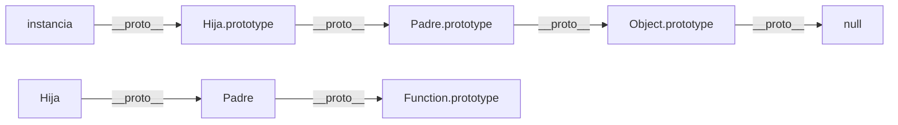

# Clases en JavaScript

> [!definicion]
> Una `class` en JavaScript es azúcar sintáctico que encapsula la creación de una función constructora, la asignación de métodos a su `.prototype` y el encadenamiento de prototipos para herencia. No introduce un modelo de objetos nuevo: el sistema subyacente es el mismo prototípico de siempre.

El modelo mental esencial:

```
class Nombre { }
      │
      ├── crea una función constructora  →  Nombre (typeof === "function")
      ├── crea un objeto prototype       →  Nombre.prototype
      └── vincula automáticamente ambos  →  instancias.__proto__ === Nombre.prototype
```

```js
class Punto {
  constructor(x, y) { this.x = x; this.y = y; }
  distancia() { return Math.hypot(this.x, this.y); }
}

const p = new Punto(3, 4);
p.distancia();         // → 5
typeof Punto;          // → "function"
p instanceof Punto;    // → true
```

## Mapa de la sección

| Nota | Concepto | Clave |
|------|----------|-------|
| 01 Declaración de Clase | Sintaxis, TDZ, modo estricto | No se hoistea |
| 02 Constructor | Inicialización, `return` especial | Un solo `constructor` por clase |
| 03 Métodos de Instancia | Definición en cuerpo, `prototype` | No enumerables |
| 04 Propiedades de Instancia | `this.prop` vs class fields | Fields van por instancia |
| 05 Métodos y Propiedades Estáticas | `static`, herencia de estáticos | `this` = la clase |
| 06 Campos Privados (#) | `#campo`, encapsulamiento real | Motor enforcea acceso |
| 07 Getters y Setters | `get`/`set` en cuerpo de clase | Propiedades de acceso |
| 08 Herencia (extends, super) | Cadena de prototipos automática | `super()` antes de `this` |
| 09 Clases como Azúcar Sintáctico | Equivalencias clase ↔ prototipo | Diferencias reales |

## Equivalencia clase → prototipo

```js
// Esto:
class Animal {
  constructor(nombre) { this.nombre = nombre; }
  hablar() { return `${this.nombre} hace un sonido.`; }
  static crear(n) { return new Animal(n); }
}

// Equivale aproximadamente a:
function Animal(nombre) { "use strict"; this.nombre = nombre; }
Object.defineProperty(Animal.prototype, "hablar", {
  value: function() { return `${this.nombre} hace un sonido.`; },
  enumerable: false, configurable: true, writable: true
});
Animal.crear = function(n) { return new Animal(n); };
```

## Cadena de prototipos con herencia



`extends` hace dos enlaces distintos: uno para las instancias (`Hija.prototype → Padre.prototype`) y otro para los estáticos (`Hija → Padre`).

## Diferencias reales respecto a funciones constructoras manuales

- **TDZ** — no hoistea; usar antes de declarar lanza `ReferenceError`.
- **Modo estricto** — el cuerpo de clase siempre corre en strict mode aunque el archivo no lo declare.
- **Métodos no enumerables** — los métodos de clase no aparecen en `for...in`; los añadidos manualmente a `prototype` sí.
- **Campos privados `#`** — sin equivalente prototípico real (se implementan con WeakMap interno).
- **`new.target`** — disponible dentro del constructor; permite detectar si se llamó con `new` y cuál fue la clase destino.
- **`super()`** — obligatorio en subclase antes de usar `this`.

## Notas relacionadas

- [[01 Declaración de Clase]]
- [[02 Constructor]]
- [[03 Métodos de Instancia]]
- [[04 Propiedades de Instancia]]
- [[05 Métodos y Propiedades Estáticas]]
- [[06 Campos Privados (#)]]
- [[07 Getters y Setters]]
- [[08 Herencia (extends, super)]]
- [[09 Clases como Azúcar Sintáctico]]
- [[02 Programación Orientada a Objetos/index | POO en JavaScript]]
