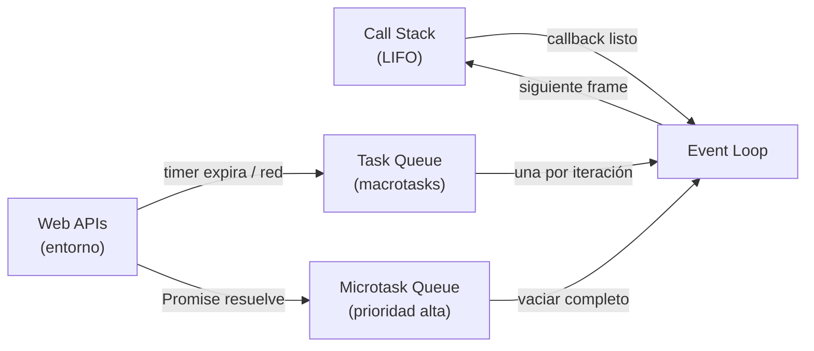

# Event Loop

> [!definicion]
> El **Event Loop** es el mecanismo del entorno de ejecución (navegador / Node.js) que permite a JavaScript —single-threaded— ejecutar código asíncrono sin bloquear. Coordina cuatro componentes y decide qué código se ejecuta a continuación cuando el Call Stack queda vacío.

```js
console.log("1 sync");
setTimeout(() => console.log("4 macro"), 0);
Promise.resolve().then(() => console.log("3 micro"));
console.log("2 sync");
// Output: 1 sync → 2 sync → 3 micro → 4 macro
```

El resultado muestra la prioridad: código síncrono → microtasks → macrotasks.

## Los cuatro componentes



- [[01 Call Stack|Call Stack]] — pila LIFO de frames de función; el Event Loop solo actúa cuando está vacío.
- [[02 Web APIs|Web APIs]] — operaciones del entorno (timers, red, DOM events); devuelven el control inmediatamente y notifican cuando terminan.
- [[03 Task Queue (Macrotasks)|Task Queue]] — cola de macrotasks (`setTimeout`, `setInterval`, eventos del DOM, I/O); el loop toma una por iteración.
- [[04 Microtask Queue|Microtask Queue]] — cola de alta prioridad (`.then()`, `queueMicrotask`, `MutationObserver`); se vacía completa antes de cada macrotask.

## Ciclo del Event Loop

1. Ejecutar el script síncrono actual hasta que el Call Stack quede vacío.
2. Vaciar la Microtask Queue completa (incluyendo microtasks generadas por microtasks).
3. Renderizar la UI si el browser lo considera necesario (~16 ms / 60 fps).
4. Tomar una macrotask de la Task Queue y ejecutarla.
5. Volver al paso 2.

El orden de prioridad queda caracterizado por: **síncrono > microtask > render > macrotask**.

## Tabla resumen de colas

| Cola | Qué encola | Prioridad | Cuántas por iteración |
|---|---|---|---|
| Microtask Queue | `.then/.catch/.finally`, `queueMicrotask`, `MutationObserver`, `await` | Alta | Todas (hasta vaciarse) |
| Task Queue | `setTimeout`, `setInterval`, `setImmediate` (Node), eventos DOM, I/O | Normal | Una |

## Notas relacionadas

- [[01 Call Stack|Call Stack]]
- [[02 Web APIs|Web APIs]]
- [[03 Task Queue (Macrotasks)|Task Queue (Macrotasks)]]
- [[04 Microtask Queue|Microtask Queue]]
- [[05 Orden de Ejecución (micro > macro)|Orden de Ejecución (micro > macro)]]
- [[01 Síncrono vs Asíncrono/index|Síncrono vs Asíncrono]]
