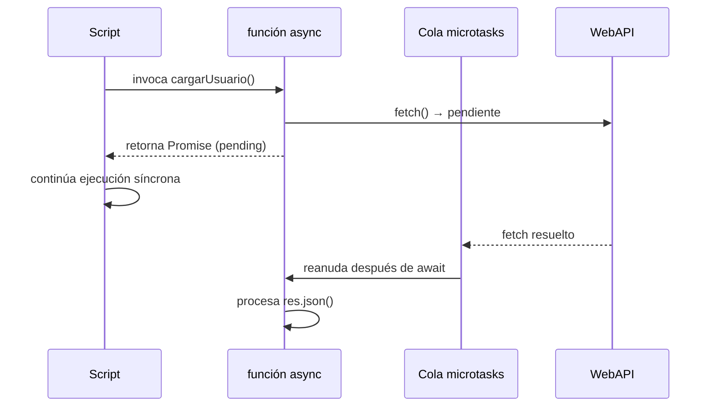

# Async / Await

> [!definicion]
> `async/await` es sintaxis azúcar sobre [[05 Promesas/index|Promesas]] que permite escribir código asíncrono con la forma visual de código síncrono. Internamente sigue operando sobre el mismo Event Loop y la misma cola de microtasks; el motor transforma la función `async` en una máquina de estados que pausa en cada `await` y reanuda cuando la Promise se asienta.

La ganancia principal no es de rendimiento sino de **legibilidad y manejo de errores**: se elimina el encadenamiento de `.then()` y los errores se capturan con `try/catch` convencional en lugar de `.catch()`.

```js
// Con .then()
fetch('/api/users/1').then(r => r.json()).then(u => console.log(u.name));

// Con async/await — misma semántica, forma lineal
async function cargarUsuario(id) {
  const res = await fetch(`/api/users/${id}`);
  const usuario = await res.json();
  console.log(usuario.name);
}
```

## Bloques de esta sección

- [[01 Función async|Función async]] — declaración, formas sintácticas, retorno implícito como Promise, top-level await.
- [[02 await|await]] — pausa la ejecución, valor devuelto, reglas de contexto, anti-patrones.
- [[03 Manejo de Errores (try-catch)|Manejo de Errores con try/catch]] — captura de rechazos, `finally`, patrones de granularidad.
- [[04 Paralelismo con Promise.all|Paralelismo con Promise.all]] — ejecución paralela vs. secuencial, `Promise.allSettled`, límite de concurrencia.
- [[05 Bucles Asíncronos (for await...of)|Bucles Asíncronos (for await...of)]] — iterables asíncronos, generadores asíncronos, streams.

## Relación con el modelo de ejecución

Cada `await` cede el control al [[02 Event Loop/index|Event Loop]], que puede ejecutar otras microtasks pendientes mientras espera la resolución de la Promise. La función `async` se reanuda en la cola de **microtasks** (no en la de macrotasks), por lo que tiene la misma prioridad de ejecución que un `.then()`.



## Cuándo usar async/await vs .then()

| Situación | Preferir |
|---|---|
| Flujo lineal, múltiples pasos | `async/await` |
| Encadenamiento funcional puro | `.then()` |
| Manejo de errores centralizado | `async/await` + `try/catch` |
| Composición de utilidades de Promesas | `.then()` / métodos estáticos |
| Top-level en módulo ES | `await` directo (ES2022) |

## Notas relacionadas

- [[05 Promesas/index|Promesas]] — el mecanismo subyacente
- [[02 Event Loop/index|Event Loop]] — cómo se gestionan las microtasks al reanudar
- [[04 Microtask Queue|Microtask Queue]] — prioridad de callbacks async/await
