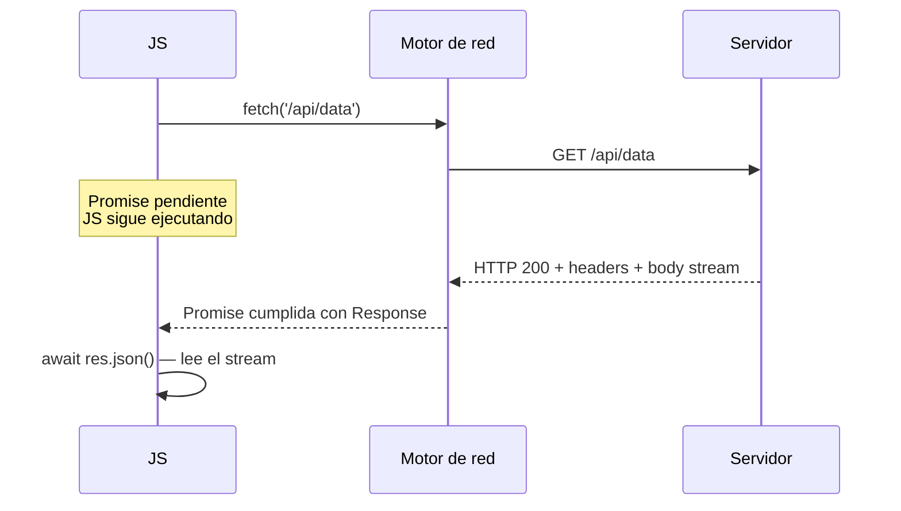

# Sintaxis Básica de `fetch`

> [!definicion]
> `fetch(url)` es una función global que inicia una petición HTTP al recurso indicado y retorna una `Promise<Response>`. Por defecto realiza un `GET` sin cuerpo ni credenciales. La Promise se **cumple** con el objeto `Response` siempre que se establezca la conexión, incluyendo respuestas 4xx y 5xx; solo **rechaza** ante fallos de red, bloqueos CORS o URLs inválidas.

```js
const res = await fetch('/api/data');
if (!res.ok) throw new Error(`HTTP ${res.status}`);
const data = await res.json();
```

La distinción crítica: un `404` o un `500` **no rechaza** la Promise — la promesa se cumple con un objeto `Response` cuyo `ok` es `false`. El rechazo solo ocurre cuando no se puede ni siquiera obtener una respuesta.

## Firma

```js
fetch(url)
fetch(url, opciones)
```

- `url` — `string` o `URL`. La URL del recurso. Puede ser relativa (resuelve contra `location.href`) o absoluta.
- `opciones` — objeto de configuración opcional. Ver [[02 Configuración (method, headers, body)|Configuración]].
- Retorna: `Promise<Response>`.

## Propiedades clave de `Response`

| Propiedad | Tipo | Descripción |
|---|---|---|
| `ok` | `boolean` | `true` si `status` está en el rango 200-299 |
| `status` | `number` | Código HTTP numérico (200, 404, 500…) |
| `statusText` | `string` | Texto del estado ("OK", "Not Found", "Internal Server Error") |
| `headers` | `Headers` | Cabeceras de la respuesta, instancia de `Headers` |
| `url` | `string` | URL final tras redirecciones |
| `redirected` | `boolean` | `true` si hubo al menos una redirección |
| `bodyUsed` | `boolean` | `true` si el body ya fue consumido |

## Patrón async/await

```js
async function obtenerUsuario(id) {
  const res = await fetch(`/api/usuarios/${id}`);

  if (!res.ok) {
    throw new Error(`HTTP ${res.status}: ${res.statusText}`);
  }

  return res.json(); // también es una Promise
}
```

La comprobación `if (!res.ok)` es obligatoria en casi todos los casos prácticos. Sin ella, un error 404 o 500 pasaría silenciosamente y `res.json()` podría lanzar un `SyntaxError` si el servidor devuelve HTML en lugar de JSON.

## Cuándo rechaza la Promise

```js
// Fallo de red — rechaza con TypeError
await fetch('https://host-inexistente.example');
// TypeError: Failed to fetch

// CORS bloqueado — rechaza con TypeError
await fetch('https://otra-origin.com/api', { mode: 'cors' });
// TypeError: Failed to fetch  (el navegador bloquea)

// URL inválida — rechaza con TypeError
await fetch('no-es-una-url-valida://x');
// TypeError: Failed to fetch

// Respuesta 404 — NO rechaza, ok=false
const res = await fetch('/recurso-inexistente');
res.ok;     // false
res.status; // 404
```

## Cómo funciona por dentro

`fetch` delega la petición al motor de red del navegador (fuera del hilo JS). Cuando la respuesta llega, el motor resuelve la Promise con el objeto `Response`. El body de la respuesta es un `ReadableStream` que aún no se ha descargado completamente en ese punto — los métodos `res.json()`, `res.text()`, etc. consumen ese stream de forma asíncrona.



> [!tip]
> Para peticiones GET simples sin cabeceras personalizadas ni body, `fetch(url)` es suficiente. El segundo argumento solo es necesario cuando se cambia el método, se añaden headers o se envía un body — ver [[02 Configuración (method, headers, body)|Configuración]].

> [!warning]
> `fetch` no lanza automáticamente en errores HTTP. El patrón `const data = await fetch(url).then(r => r.json())` sin comprobar `r.ok` silencia silenciosamente errores 4xx/5xx. Siempre comprobar `res.ok` o `res.status` antes de deserializar el body.

## Notas relacionadas

- [[02 Configuración (method, headers, body)|Configuración (method, headers, body)]] — método, headers, body
- [[04 Objeto Response|Objeto Response]] — todas las propiedades del objeto Response
- [[05 Procesar Respuesta (json, text, blob)|Procesar Respuesta]] — métodos para leer el body
- [[06 Manejo de Errores|Manejo de Errores]] — estrategia completa de manejo de errores
