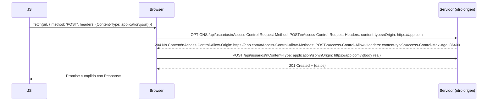

# Peticiones Simples vs Preflight

> [!definicion]
> El navegador clasifica las peticiones cross-origin en dos categorías según su potencial de efecto secundario. Las **peticiones simples** se envían directamente al servidor; el browser comprueba las cabeceras CORS de la respuesta antes de entregar el resultado al JS. Las **peticiones con preflight** disparan primero una petición `OPTIONS` automática — el browser pide permiso al servidor antes de ejecutar la petición real. Si el servidor rechaza el preflight, la petición real nunca se envía.

## Peticiones simples

Una petición es "simple" si cumple todas las condiciones simultáneamente:

- Método: `GET`, `HEAD` o `POST`.
- Cabeceras: solo las de la lista segura (ninguna personalizada como `Authorization`).
- `Content-Type` (si hay body): solo `text/plain`, `multipart/form-data` o `application/x-www-form-urlencoded`.
- Sin `ReadableStream` en el body.

```js
// Petición simple — no hay preflight
const res = await fetch('https://api.otro.com/productos');
// El browser envía GET directamente y comprueba Access-Control-Allow-Origin en la respuesta

// También simple (POST con urlencoded)
const res = await fetch('https://api.otro.com/contacto', {
  method: 'POST',
  body: new URLSearchParams({ nombre: 'Ana', email: 'ana@x.com' }),
});
```

> [!warning]
> Aunque no haya preflight, la SOP sigue aplicando: si el servidor no devuelve `Access-Control-Allow-Origin` correcto, el browser bloquea la respuesta. Para peticiones mutantes (`POST`) esto es peligroso: la acción en el servidor ya ocurrió aunque el JS no lea la respuesta.

## Peticiones con preflight

Se dispara un preflight cuando **cualquiera** de estas condiciones se cumple:

- Método: `PUT`, `PATCH`, `DELETE`, `CONNECT`, `OPTIONS`, `TRACE`.
- Cabecera personalizada: `Authorization`, `Content-Type: application/json`, `X-Custom-Header`, etc.
- `Content-Type` distinto de los tres permitidos.
- `ReadableStream` como body.

```js
// Petición con preflight — Content-Type: application/json lo desencadena
const res = await fetch('https://api.otro.com/usuarios', {
  method: 'POST',
  headers: { 'Content-Type': 'application/json' },
  body: JSON.stringify({ nombre: 'Ana' }),
});
// 1. Browser envía OPTIONS /usuarios con Access-Control-Request-*
// 2. Servidor responde con Access-Control-Allow-*
// 3. Browser envía POST real
```

## Flujo del preflight



## Tabla comparativa

| Característica | Petición simple | Petición con preflight |
|---|---|---|
| Métodos | GET, HEAD, POST | PUT, PATCH, DELETE u otros |
| Content-Type | text/plain, multipart, urlencoded | application/json u otros |
| Cabeceras personalizadas | No | Sí (Authorization, etc.) |
| Pasos de red | 1 (petición directa) | 2 (OPTIONS + petición real) |
| Riesgo si no hay CORS | Acción ejecutada, respuesta bloqueada | Acción nunca ejecutada |
| Cache del preflight | N/A | Access-Control-Max-Age |

## Caché del preflight

El servidor puede indicar cuánto tiempo el browser puede cachear el resultado del preflight con `Access-Control-Max-Age: 86400` (en segundos). Durante ese periodo, peticiones idénticas al mismo origen no disparan un `OPTIONS` adicional. Sin este header, el preflight se repite en cada petición o cada cierto tiempo según el browser.

> [!tip]
> Para reducir la latencia en APIs usadas frecuentemente, configurar `Access-Control-Max-Age` a un valor alto (3600–86400 s). El browser cachea el resultado por ruta y método — distintas rutas o métodos tienen cachés separadas.

> [!warning]
> Un error común es que el servidor gestione correctamente `GET` y `POST` pero no responda adecuadamente a `OPTIONS`. El servidor debe devolver 200 o 204 en la ruta correspondiente ante un `OPTIONS` con las cabeceras `Access-Control-Allow-*` — si devuelve 404 o 405, el browser bloquea la petición real aunque la ruta exista para otros métodos.

## Notas relacionadas

- [[01 Same-Origin Policy|Same-Origin Policy]] — la restricción que motiva el preflight
- [[03 Cabeceras CORS|Cabeceras CORS]] — qué devolver en la respuesta al preflight
- [[04 Credenciales|Credenciales]] — credenciales añaden requisitos adicionales al preflight
