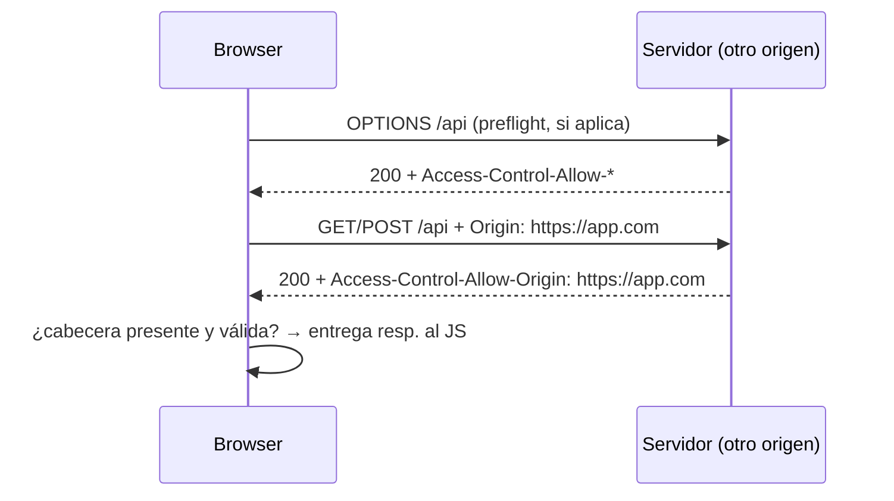

# CORS

> [!definicion]
> **CORS (Cross-Origin Resource Sharing)** es el mecanismo mediante el cual un servidor indica qué orígenes externos pueden leer sus respuestas. Es una relajación controlada de la [[01 Same-Origin Policy|Same-Origin Policy]]: por defecto el navegador bloquea las respuestas de peticiones cross-origin; el servidor puede levantar ese bloqueo enviando cabeceras HTTP específicas (`Access-Control-Allow-Origin`, etc.). CORS se aplica en el navegador — el servidor recibe la petición en cualquier caso, pero el JS del cliente no puede leer la respuesta si falta la autorización.

El error más habitual en desarrollo: `Access to fetch at 'https://api.ejemplo.com' from origin 'http://localhost:3000' has been blocked by CORS policy`.

```js
// Sin CORS configurado en el servidor — el browser bloquea la respuesta
const res = await fetch('https://api.otro-dominio.com/datos');
// TypeError: Failed to fetch  (o el error CORS específico en consola)

// Con CORS configurado correctamente — funciona
const res = await fetch('https://api.otro-dominio.com/datos');
const data = await res.json(); // ✓
```

## Bloques de esta sección

- [[01 Same-Origin Policy|Same-Origin Policy]] — qué es un "origen", qué bloquea por defecto y por qué.
- [[02 Peticiones Simples vs Preflight|Peticiones Simples vs Preflight]] — cuándo el browser envía primero un `OPTIONS` y cuándo no.
- [[03 Cabeceras CORS|Cabeceras CORS]] — `Access-Control-Allow-Origin`, `Allow-Methods`, `Allow-Headers`, `Max-Age`, `Expose-Headers`.
- [[04 Credenciales|Credenciales]] — cookies y autenticación cross-origin: `credentials: "include"` y requisitos del servidor.

## Flujo general



## Notas relacionadas

- [[01 Same-Origin Policy|Same-Origin Policy]] — la restricción base que CORS relaja
- [[../01 Fetch API/03 mode, credentials, cache|mode, credentials, cache]] — opciones de fetch relacionadas con CORS
- [[04 Credenciales|Credenciales]] — cookies y tokens en peticiones cross-origin
